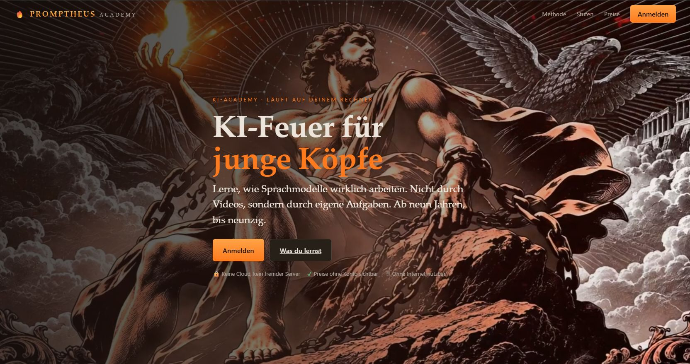
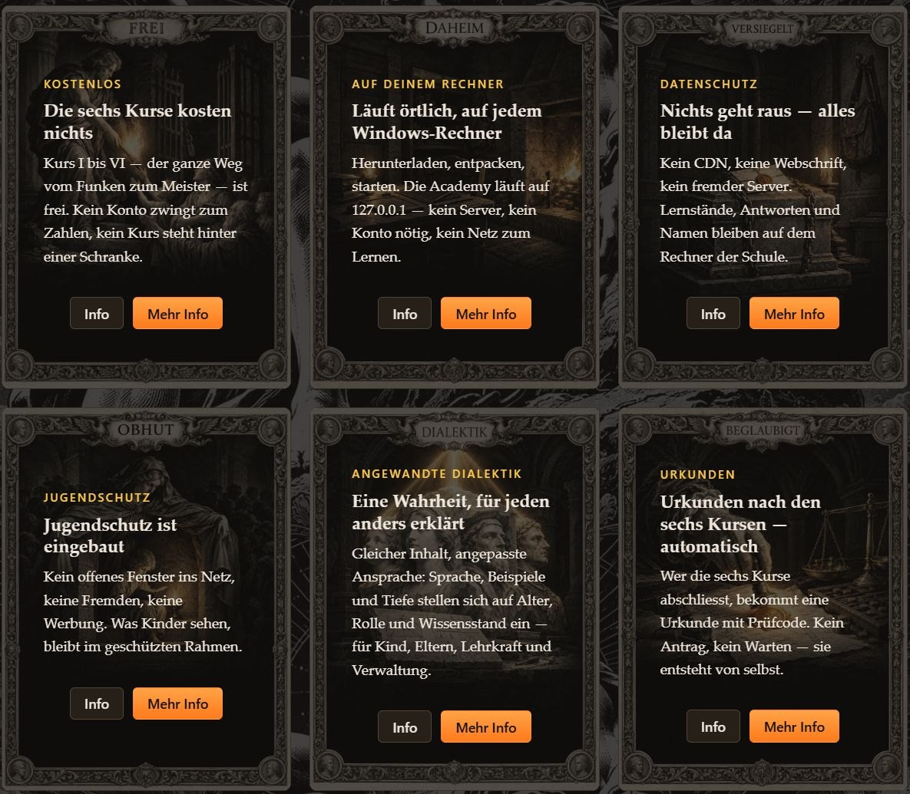
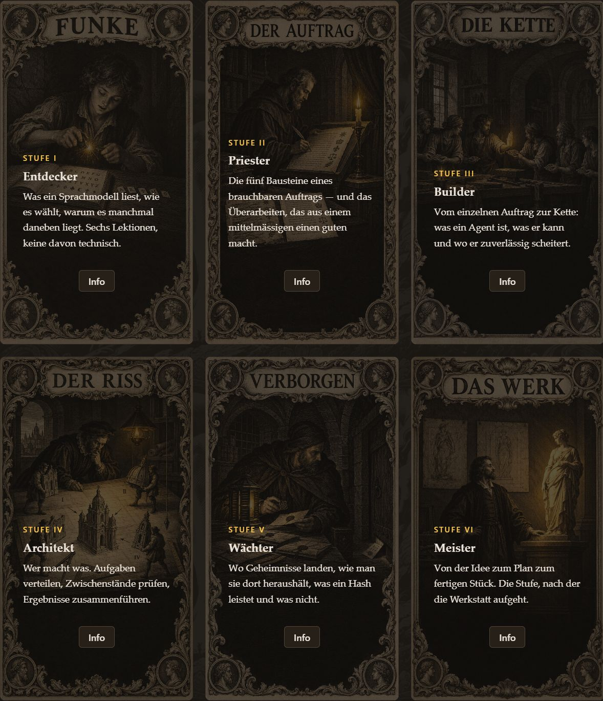
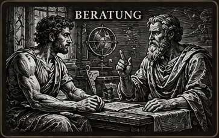
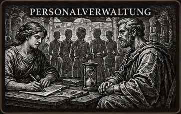
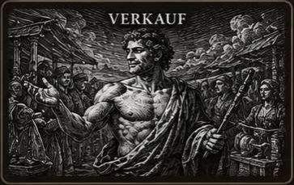
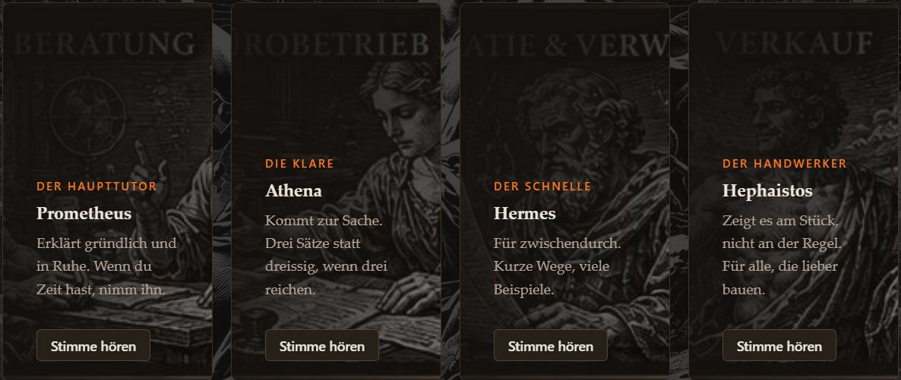
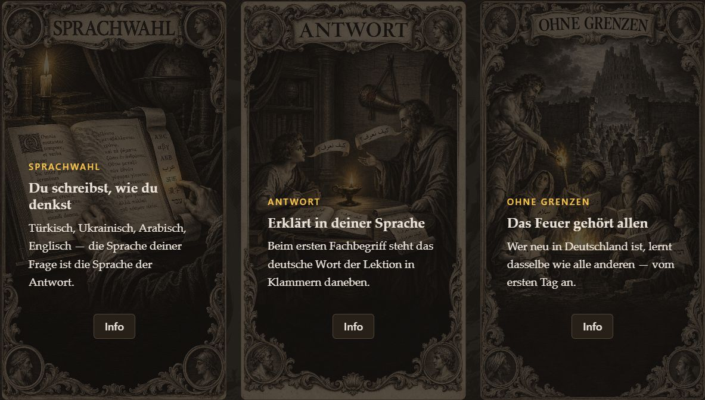
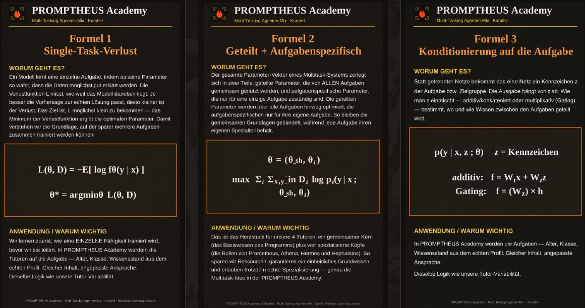
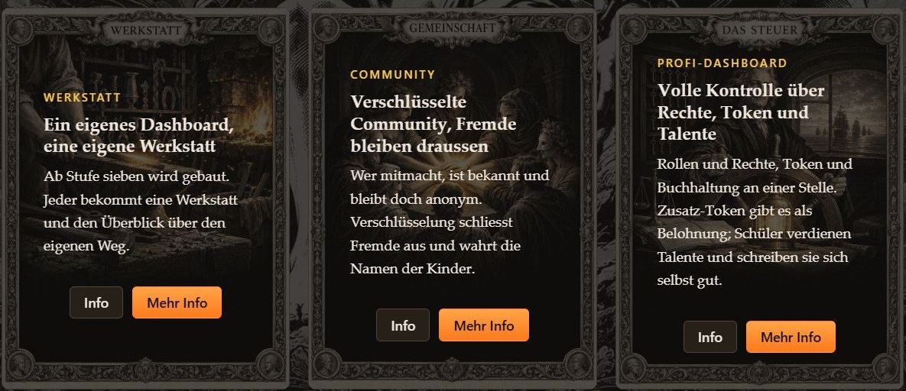

# PROMPTHEUS ACADEMY



**Lerne, wie Sprachmodelle wirklich arbeiten — durch eigene Aufgaben statt durch
Videos. Ab neun Jahren, bis neunzig.**

PROMPTHEUS läuft **auf deinem eigenen Rechner** unter `127.0.0.1`: kein Konto in
der Cloud, keine Telemetrie, kein fremder Server. Sechs Stufen führen von den
Grundlagen bis zum eigenen Agenten, vier Tutoren begleiten dabei. Bewertet wird
deterministisch aus deinen Versuchen, nicht von einem Modell — eine Urkunde, die
heute anders zustande käme als gestern, wäre wertlos.

<p align="center">
  <a href="https://example.org/promptheus/"><b>Webseite</b></a> ·
  <a href="https://example.org/promptheus/stufen.php">Stufen</a> ·
  <a href="https://example.org/promptheus/werkstatt.php">Werkstatt und Community</a> ·
  <a href="https://example.org/promptheus/3d-game.php">3D-Game</a> ·
  <a href="https://example.org/promptheus/preise.php">Preise</a>
</p>

---

## Installation

### Mit einem KI-Agenten

Am bequemsten geht es mit einem Coding-Agenten auf deinem Rechner, zum Beispiel
**Claude Code** (Anthropic), **Codex** (OpenAI), **Gemini CLI** (Google), dem
**Hermes Agent** (Nous Research) oder einem Agenten mit **Grok** (xAI) als
Modell. Gib ihm den Link zu diesem Repository, den Rest erledigt er: Er liest
diese Anleitung, holt PHP und startet die Academy. Du stimmst nur zu, wenn er
etwas installieren will.

Diesen Auftrag kannst du so übernehmen:

```text
Installiere PROMPTHEUS ACADEMY aus https://github.com/DEVinDEV-dan/promptheus-academy
auf diesem Rechner und folge dabei der README. Starte die Academy nur auf 127.0.0.1
und frag mich, bevor du Software installierst.
```

### Selbst, mit einem Terminalbefehl (Windows)

Öffne **PowerShell** (Startmenü → „PowerShell“) und füge diesen Block ein. Er
lädt die Academy von GitHub, legt PHP 8.3 von php.net in den Ordner, den das
Startskript erwartet, und startet die Academy:

```powershell
$ProgressPreference = 'SilentlyContinue'
Invoke-WebRequest https://github.com/DEVinDEV-dan/promptheus-academy/archive/refs/heads/main.zip -OutFile promptheus.zip
Expand-Archive promptheus.zip -DestinationPath . ; Remove-Item promptheus.zip
Set-Location promptheus-academy-main
Invoke-WebRequest https://windows.php.net/downloads/releases/latest/php-8.3-nts-Win32-vs16-x64-latest.zip -OutFile php.zip
Expand-Archive php.zip -DestinationPath php\php8.2 ; Remove-Item php.zip
.\promptheus-start.bat
```

Der Browser öffnet sich mit <http://127.0.0.1:8801/>. Später genügt ein
Doppelklick auf `promptheus-start.bat` im Ordner `promptheus-academy-main`.

- **Download:** rund 19 MB Academy und 34 MB PHP. Danach geht beim Lernen nichts
  mehr hinaus, ausser du schaltest die KI-Tutoren ein (siehe unten).
- **Ordner:** Die Befehle legen `promptheus-academy-main` dort an, wo PowerShell
  gerade steht, meist in deinem Benutzerordner. Windows verkraftet nur Pfade bis
  260 Zeichen; ein tief verschachtelter Ordner ist deshalb ein schlechter Ort.
- **Meldet das Startfenster eine fehlende Laufzeit:** PHP braucht die Microsoft
  Visual C++ Redistributable. Sie kommt mit
  `winget install Microsoft.VCRedist.2015+.x64` auf den Rechner.
- **Mit Git statt ZIP:** `git clone https://github.com/DEVinDEV-dan/promptheus-academy.git`,
  dann im Ordner die beiden PHP-Zeilen und den Start wie oben.

### macOS und Linux

PHP 8.2 oder neuer mit den Erweiterungen `pdo_sqlite`, `sqlite3`, `mbstring`,
`curl`, `openssl` und `sodium` installieren (Linux über die Paketverwaltung,
macOS mit `brew install php`), dann im Ordner der Academy:

```sh
php -S 127.0.0.1:8801 -t . router.php
```

Geprüft ist bisher Windows. Was ein Rechner genau mitbringen muss, steht in
[REQUIREMENTS.md](REQUIREMENTS.md).

---

## Was dich erwartet

### Die Grundsätze



Die sechs Kurse kosten nichts, und kein Kurs steht hinter einer Schranke. Die
Academy läuft örtlich auf jedem Windows-Rechner; Lernstände, Antworten und Namen
bleiben auf dem Rechner der Schule. Es gibt kein offenes Fenster ins Netz, keine
Fremden und keine Werbung. Derselbe Inhalt stellt sich in Sprache, Beispielen
und Tiefe auf Alter, Rolle und Wissensstand ein — für Kind, Eltern, Lehrkraft und
Verwaltung. Wer die sechs Kurse abschliesst, bekommt eine Urkunde mit Prüfcode,
ohne Antrag und ohne Warten.

### Sechs Stufen



| Stufe | Name | Worum es geht |
|---|---|---|
| I | **Entdecker** | Was ein Sprachmodell liest, wie es wählt und warum es manchmal danebenliegt. Sechs Lektionen, keine davon technisch. |
| II | **Priester** | Die fünf Bausteine eines brauchbaren Auftrags, und das Überarbeiten, das aus einem mittelmässigen einen guten macht. |
| III | **Builder** | Vom einzelnen Auftrag zur Kette: was ein Agent ist, was er kann und wo er zuverlässig scheitert. |
| IV | **Architekt** | Wer macht was: Aufgaben verteilen, Zwischenstände prüfen, Ergebnisse zusammenführen. |
| V | **Wächter** | Wo Geheimnisse landen, wie man sie dort heraushält, was ein Hash leistet und was nicht. |
| VI | **Meister** | Von der Idee zum Plan zum fertigen Stück. Nach dieser Stufe geht die Werkstatt auf. |

Jede Stufe endet mit einer Prüfung. Bewertet wird aus deinen Versuchen, nach
festen Regeln. Mehr dazu auf der Webseite unter
[Stufen](https://example.org/promptheus/stufen.php).

### Zehn Fachkurse

Neben den Stufen laufen zehn Wahlkurse für einzelne Berufsfelder. Sie setzen die
Stufen I bis III voraus und sind im Aufbau.

<table>
<tr>
<td align="center"><br>Beratung</td>
<td align="center"><br>Buchhaltung</td>
<td align="center"><br>Bürobetrieb</td>
<td align="center"><br>Bürokratie</td>
<td align="center"><br>Dienstleistung</td>
</tr>
<tr>
<td align="center"><br>Handel</td>
<td align="center"><br>Jura</td>
<td align="center"><br>Personalverwaltung</td>
<td align="center"><br>Sicherheit</td>
<td align="center"><br>Verkauf</td>
</tr>
</table>

### Vier Tutoren



**Prometheus** erklärt gründlich und in Ruhe. **Athena** kommt zur Sache: drei
Sätze statt dreissig, wenn drei reichen. **Hermes** ist für zwischendurch, mit
kurzen Wegen und vielen Beispielen. **Hephaistos** zeigt es am Stück, nicht an
der Regel. Jeder hat eine eigene Stimme. Kurse, Aufgaben, Prüfungen und Urkunden
laufen auch ganz ohne Sprachmodell.

### In deiner Sprache



Die Sprache deiner Frage ist die Sprache der Antwort, ob Türkisch, Ukrainisch,
Arabisch oder Englisch. Beim ersten Fachbegriff steht das deutsche Wort der
Lektion in Klammern daneben. Wer neu in Deutschland ist, lernt dasselbe wie alle
anderen, vom ersten Tag an.

### Was hinter den Modellen steckt



Für die Älteren erklären Kursteile auch die Mathematik dahinter. Jede Karte sagt,
worum es geht, zeigt die Formel und erklärt, wo genau sie in der Academy
wiederkehrt. Die vier Tutoren etwa sind ein gemeinsamer Kern mit vier
spezialisierten Köpfen.

### Werkstatt, Gemeinde und Steuer



- **Werkstatt:** Nach Stufe VI wird gebaut. Jeder bekommt eine eigene Werkstatt
  und den Überblick über den eigenen Weg.
- **Gemeinde:** Prompts, Skills und Plugins aus vielen Academies, unter
  Pseudonymen statt Namen. Jedes Werk prüft ein Mensch, bevor andere es sehen.
  Persönliche Angaben wie Namen, Orte, Telefonnummern oder Schlüssel werden
  schon beim Tippen zu „xxx“. Die Gemeinde ist nur in registrierten Academies
  sichtbar und kommt mit der nächsten Fassung. Wie ein Werk aus der Werkstatt in
  die Community kommt, steht auf der Webseite unter
  [Werkstatt und Community](https://example.org/promptheus/werkstatt.php).
- **Steuer:** Rollen und Rechte, Token und Buchhaltung an einer Stelle, für
  Lehrkräfte und Verwaltung.

### Das Spiel (in Planung)


Eine begehbare Akademie in 3D: sieben Flügel mit je elf Kammern. Die Spielfigur
Promptheus trägt die Flamme hinein und spricht mit der Stimme des Tutors
Prometheus. In jeder Kammer werden Begriffe der künstlichen Intelligenz zu
Dingen, die man anfasst und ausprobiert, mit echter Physik und kleinen
Versuchen. Neue Kammern öffnen sich nur mit verdienten Funken, und der Stand
bleibt über jeden Neustart erhalten. Das Spiel soll ein ganzes Schuljahr tragen,
nicht nur einen Nachmittag. Mehr auf der Webseite unter
[3D-Game](https://example.org/promptheus/3d-game.php).

---

## Aufbau

| Ordner | Inhalt |
|---|---|
| `srv/` | der Kern: Kurse, Aufgaben, Punkte, Prüfungen, Tutoren, Einstellungen |
| `assets/` | Oberfläche (JavaScript, CSS, Bilder) |
| `secondbrain/` | der Lehrstoff als Markdown — ein neuer Kurs ist eine neue Datei, kein Codeeingriff |
| `Brand/` | die verbindliche Marke: Farben, Schrift, Ton |
| `recht/` | AGB, Datenschutz, AVV, Impressum, Widerruf (Entwürfe) |
| `tests/` | eigene Prüfungen, ohne Fremdpaket |
| `docs/bilder/` | die Bilder dieser Seite |
| `data/` | Datenbank und Lernstände. **Bleibt lokal und gehört nicht ins Git.** |

Die Serverseite (Registrierung, Gemeinde, Abrechnung) gehört nicht zu diesem
Repository. Die Academy spricht mit ihr nur über signierte Anfragen und nur,
wenn eine Schule sich registriert.

## Tests

```bat
php\php8.2\php.exe tests\relay_test.php
```

Das geht nach dem ersten Start: `promptheus-start.bat` legt dabei die `php.ini`
mit den nötigen Erweiterungen an. Jeder Test ist eine PHP-Datei, die
`tests/hilfe.php` einbindet und mit `bilanz()` endet.

## KI-Tutoren einrichten (optional)

Die Kurse, Aufgaben, Prüfungen und Urkunden laufen **ohne Sprachmodell**. Wer
die Tutoren sprechen lassen will, kopiert `.env.example` nach `.env` und trägt
einen OpenRouter-Schlüssel ein — oder setzt ihn in den Einstellungen unter
„Tutor-KI“. Der Schlüssel wird nie angezeigt, auch nicht teilweise. Was du den
Tutor fragst, geht dann über OpenRouter an den gewählten Modellanbieter.

## Lizenz

**PolyForm Shield 1.0.0** — benutzen, ändern und weitergeben ist erlaubt, auch
geschäftlich; nicht erlaubt ist ein konkurrierendes Produkt aus PROMPTHEUS oder
Teilen davon.

- Verbindlicher Text: [LICENSE](LICENSE)
- Erklärung in einfachen Worten: [LIZENZ.md](LIZENZ.md)

**Was Nutzer mit dem Programm erstellen, gehört ihnen.** Die Lizenz gilt für
PROMPTHEUS, nicht für die eigenen Inhalte.
