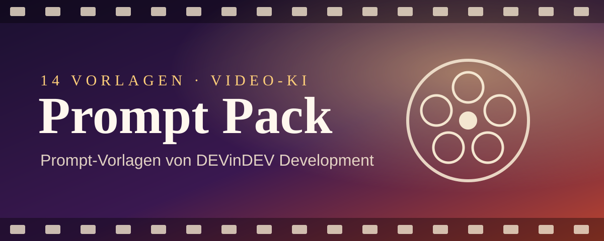
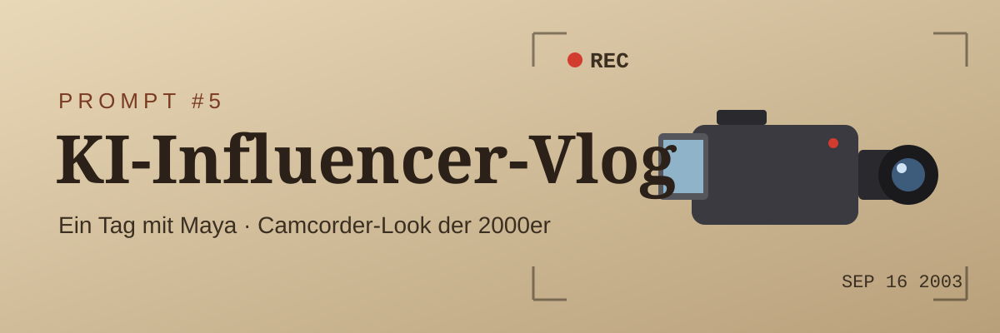
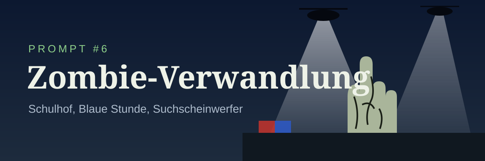
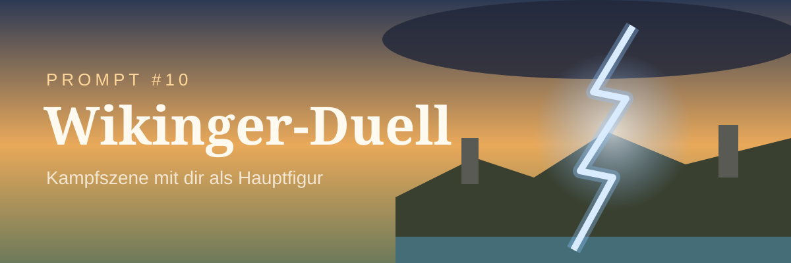
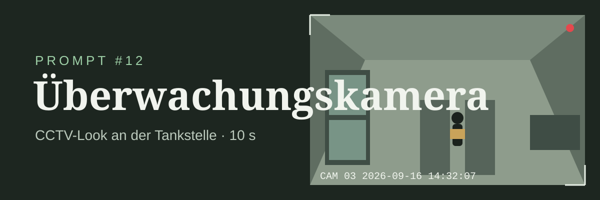
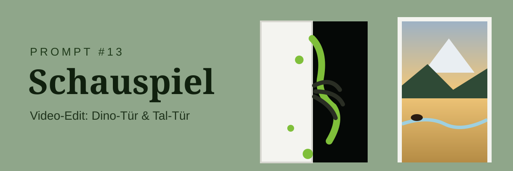

# Prompt Pack – KI-Video-Prompts

> **14 Prompt-Vorlagen für KI-Videos** – von DEVinDEV Development
> Jede Vorlage ist sofort einsetzbar: Referenzbild hochladen, Prompt kopieren, generieren.

---

## 🧰 Was du brauchst

- **[Higgsfield](https://higgsfield.ai/)** → zum Erstellen der Bilder und Videos
- Je nach Vorlage: ein **Referenzbild** (`@Image 1`), teils ein **Referenzvideo** (`@Video 1`) für Stimme oder Kamerabewegung

### So benutzt du die Vorlagen

| Platzhalter | Bedeutung |
|---|---|
| `@Image 1`, `@image1` | das erste hochgeladene Referenzbild |
| `@Image 2 … @Image 10` | weitere Referenzbilder in der Upload-Reihenfolge |
| `@Video 1`, `@video1` | hochgeladenes Referenzvideo (Stimme, Kamerafahrt oder Quellmaterial) |
| **Dan,** / **DAN** | Name der Hauptfigur – durch deinen eigenen Namen ersetzen |

> 💡 **Tipp:** Die meisten Video-Modelle verstehen deutsche Prompts gut. Wenn ein Detail nicht sitzt (z. B. Schreibweise von Schriftzügen oder exakte Kamerabewegung), lohnt sich ein Gegentest mit einer englischen Fassung.

### Inhalt

1. [Zeitstopp](#prompt-1--zeitstopp)
2. [KI-UGC-Werbung](#prompt-2--ki-ugc-werbung)
3. [Paparazzi-Video von dir selbst](#prompt-3--paparazzi-video-von-dir-selbst)
4. [Wasser auf den Schreibtisch (Prank)](#prompt-4--wasser-auf-den-schreibtisch-prank)
5. [KI-Influencer-Vlog](#prompt-5--ki-influencer-vlog)
6. [Zombie-Verwandlung](#prompt-6--zombie-verwandlung)
7. [Mit dem Riesenadler durch das Alte Ägypten](#prompt-7--mit-dem-riesenadler-durch-das-alte-ägypten)
8. [Blender-Kamerafahrt](#prompt-8--blender-kamerafahrt)
9. [Charakter-Intro (Gaming)](#prompt-9--charakter-intro-gaming)
10. [Kampfszene mit dir als Hauptfigur](#prompt-10--kampfszene-mit-dir-als-hauptfigur)
11. [POV-Kochen](#prompt-11--pov-kochen)
12. [Überwachungskamera-Aufnahme](#prompt-12--überwachungskamera-aufnahme)
13. [Schauspiel](#prompt-13--schauspiel)
14. [Urlaubs-Vlog](#prompt-14--urlaubs-vlog)

---

## Prompt #1 – Zeitstopp

**Benötigt:** `@image1` – Foto der Studentin (Hauptfigur)
**Format:** eine durchgehende Plansequenz ohne Schnitt

### Prompt →

**[REFERENZ]**
@image1 – die Studentin. Nutze diese Referenz für ihr Gesicht, ihre Haare, ihre Körperproportionen, ihre Kleidung und ihre gesamte Identität. Übernimm nicht den Hintergrund, das Licht oder die Pose der Referenz.

**[SZENE]**
Ein realistischer, moderner Universitätsflur tagsüber. Belebte, aber natürliche Atmosphäre: Studierende laufen in beide Richtungen, leise Gespräche, Schritte, Hörsaaltüren öffnen sich, Plakate an den Wänden, Spinde, Bänke, und Tageslicht fällt durch große Fenster, gemischt mit der Innenbeleuchtung.

Die Hauptfigur ist eine 20–22-jährige amerikanische Studentin, die @image1 entspricht. Sie wirkt realistisch, natürlich und bodenständig. Sie trägt Bücher, ein Notizbuch, eine Mappe, lose Blätter, einen Stift, ein Handy, Haftnotizen und eine Umhängetasche – leicht chaotisch, als würde sie zwischen zwei Vorlesungen hetzen.

Ein Student Anfang zwanzig kommt aus der Gegenrichtung. Er hat kurze dunkle Haare, eine durchschnittliche Statur und trägt eine dunkle, lässige Jacke, ein schlichtes Shirt, Jeans, Sneaker und Kopfhörer. Er schaut beim Gehen auf sein Handy.

**[VISUELLER STIL]**
Ultrarealistischer, filmischer Realfilm. Natürliche Hautdetails, realistische Stoffe, physikalisch korrekte Bewegung, geringe Schärfentiefe, weicher Tageslicht-Glow, dezenter Lens Flare und das Gefühl einer handgeführten 35-mm-Filmkamera mit leichter natürlicher Bewegung und Fokusatmen.

**[KAMERA]**
Nur eine einzige durchgehende Tracking-Einstellung. Die Kamera folgt dem Mädchen von hinten und leicht seitlich, während sie durch den Flur geht. Natürliche Handkamera-Bewegung, gelegentlich teilweise verdeckt durch vorbeigehende Studierende, für mehr Realismus.

**[AKTION – ZUSAMMENSTOSS]**
Das Mädchen biegt um eine Ecke und sortiert dabei ihre Blätter.
Im selben Moment tritt der Student in ihren Weg.
Sie stoßen mit einem natürlichen Schulterkontakt zusammen.
Ihre Sachen fliegen mit realistischer Physik davon:

- Bücher fliegen in verschiedene Richtungen
- Blätter verteilen sich und drehen sich in der Luft
- die Mappe öffnet sich in der Luft und verliert Blätter
- das Notizbuch klappt teilweise auf
- der Stift wirbelt davon
- das Handy rutscht nach unten
- Haftnotizen verstreuen sich auf unterschiedlichen Höhen

Das Mädchen verliert das Gleichgewicht und beginnt, in einem klaren Bogen rückwärts zu fallen – weg von dem Studenten.
Der Student reagiert sofort, macht einen Schritt nach vorn und streckt den Arm nach ihr aus.

**[ZEITSTOPP]**
Genau in der Mitte ihres Rückwärtsfalls bleibt die Zeit vollständig stehen.
Alles erstarrt: Studierende mitten im Schritt, Haare in der Luft, Spiegelungen eingefroren, Staub in den Lichtstrahlen.
Das Mädchen ist mitten im Fall eingefroren, rückwärts vom Studenten weg.

**WICHTIGE POSITIONSREGEL:**
Der Student steht eingefroren direkt vor ihrer Fallbahn. Sein Arm ist vollständig nach vorn in ihre Flugbahn gestreckt, auf Höhe ihres Handgelenks/Unterarms. Er steht NICHT hinter ihr und zieht sie NOCH NICHT – er ist so positioniert, dass er ihren Fall abfangen kann.
Alle schwebenden Gegenstände bleiben genau dort, wo sie beim Aufprall waren.

**[KAMERA – ERKUNDUNG DER EINGEFRORENEN ZEIT]**
Die Kamera bewegt sich weiter durch die erstarrte Welt.
Sie gleitet durch schwebende Blätter, Bücher und Gegenstände in der Luft. Nahaufnahmen zeigen Papierstruktur, Handschrift, Notizbuchseiten und Buchumschläge.
Die Kamera umkreist das Mädchen und zeigt deutlich ihre eingefrorene Rückwärtsfall-Haltung und ihren Gesichtsausdruck.
Dann bewegt sie sich zum Studenten und zeigt seinen ausgestreckten Arm, perfekt auf ihre Fallbahn ausgerichtet, seine Hand genau am Abfangpunkt ihres Handgelenks/Unterarms.

**KLARSTELLUNG:**
Er zieht sie nicht. Er wartet vor ihrer Fallrichtung, bereit, ihren Schwung abzufangen, sobald die Zeit weiterläuft.

**[FORTSETZUNG]**
Die Kamera beendet den Kreis und rahmt beide Figuren einander zugewandt ein.
Die Zeit läuft sofort weiter, ohne visuellen Effekt.
Das Mädchen fällt noch einen Sekundenbruchteil weiter rückwärts.
Der Student fängt sofort ihr Handgelenk/ihren Unterarm genau am Abfangpunkt, nimmt ihren Rückwärtsschwung auf und stoppt ihren Fall sicher.
Er stabilisiert ihren Oberkörper und bringt sie sanft wieder ins Gleichgewicht. Es gibt keine Ziehbewegung – nur ein kontrolliertes Auffangen und Stabilisieren.

Ihre Sachen fallen natürlich nacheinander herunter:
zuerst die Bücher, dann die Blätter, dann die Mappenseiten, Notizbuch, Stift, Handy, und die Haftnotizen verteilen sich auf dem Boden.
Der Flur geht ganz normal weiter. Die anderen Studierenden reagieren nicht.
Das Mädchen findet ihr Gleichgewicht, sieht ihn überrascht an und dann nach unten auf die verstreuten Sachen. Er lässt sie los, sobald sie sicher steht.

**[ENDE]**
Sie stehen einen Moment einander gegenüber im belebten Flur, während das Leben um sie herum weitergeht. Filmische Halbtotale, geringe Schärfentiefe, natürliche Bewegung im Hintergrund.

**[KONTINUITÄTSREGELN]**

- Das Mädchen muss identisch mit @image1 bleiben
- Alle Gegenstände stammen ausschließlich aus ihren Sachen
- Die Physik muss vor, während und nach dem Zeitstopp konsistent bleiben
- Der Student muss immer vor ihrer Fallbahn stehen, ausgerichtet auf den Abfangpunkt
- Keine Gegenstände tauchen auf oder verschwinden

**[REGELN]**
Nur eine einzige durchgehende filmische Einstellung. Keine Schnitte, keine Montage, keine Teleportation, keine stilisierten Effekte. Der Zeitstopp ist reiner Stillstand der Umgebung – nur die Kamera bewegt sich.

---

## Prompt #2 – KI-UGC-Werbung

**Benötigt:** `@Image 1` – Produktfoto
**Format:** vertikal 9:16, eine lange Einstellung

### Prompt →

**@Image 1 – Produktreferenz.** Das Produkt, das sie in der Hand hält und über das sie spricht. Form, Proportionen, Materialien, Farbe, Etikett und Text exakt wie in der Referenz. Es ist ein und dasselbe Produkt – verändere weder Design noch Branding.

**Kein Referenzbild für die Person – sie ist frei erfunden:** eine Frau Mitte zwanzig, warmer heller Teint mit leichtem, frischem Glow, dunkelblonde Haare locker zurückgebunden, ein paar lose Strähnen umrahmen ihr Gesicht, glänzende Hydrogel-Augenpads unter beiden Augen, die das Licht einfangen, definierte Augenbrauen, natürliches glossy Make-up, ein auffallend wacher, strahlender Ausdruck. Sie trägt einen blauen Satin-Bademantel, locker und am Schlüsselbein leicht geöffnet, der Stoff glänzt bei jeder Bewegung.

**Szenenkontext:** Sie steht in ihrem Badezimmer und macht sich fertig. Sie hält ihr Handy vor sich, um sich selbst zu filmen, und will es gleich abstellen, damit sie freihändig über ein Produkt sprechen kann, das sie gerade gekauft hat – aufgeregt und gesprächig, sie möchte es ihren Followern zeigen.

Eine lange, durchgehende Einstellung ohne Schnitt, zunächst mit dem Handy gefilmt, das sie selbst auf Armlänge hält, in den ersten Sekunden leichtes natürliches Wackeln aus der Hand, vertikales 9:16-Format, weiches warmes Badezimmerlicht mit einem leichten Schein von einer nicht sichtbaren Spiegelleuchte oben seitlich, eine Glasduschkabine und helle Fliesen weich unscharf im Hintergrund, natürliche Hauttöne, geringe Schärfentiefe, naher Raumklang mit klarer, naher Stimme durch das Handymikrofon – sobald das Handy abgestellt wird, klingt es etwas offener und räumlicher.

Der Clip beginnt extrem nah und leicht unscharf auf ihrem Gesicht, während sie sich mitten im Satz zur Kamera beugt, die Lippen bewegen sich, die Kamera wackelt sichtbar, weil sie ihren Griff anpasst. In den nächsten Sekunden zieht sie das Handy zurück, greift nach vorn und stellt es aufrecht an die Kante des Waschtischs vor sich. Der Fokus wird scharf, das Bild beruhigt sich zu einer ruhigen Kopf-Schulter-Einstellung mit nur noch natürlichen Mikrobewegungen. Sobald das Handy steht, nimmt sie das Produkt von knapp außerhalb des Bildes, hält es in Richtung Objektiv und dreht es leicht, um das Etikett zu zeigen, während sie spricht. Sie gestikuliert mit der freien Hand, hebt die Augenbrauen, nickt zur Betonung, schaut ab und zu auf das Produkt und dann wieder ins Objektiv. Natürliches Blinzeln, Mundbewegungen passend zu durchgehend lockerem Sprechen, warmer, engagierter Ausdruck.

**Konsistent halten:** dieselbe Person, dieselben Augenpads, derselbe blaue Satin-Bademantel, dieselbe Produktidentität und dasselbe Etikett wie in @Image 1, dasselbe weiche Badezimmerlicht und die Dusche im Hintergrund während der gesamten Einstellung.

---

## Prompt #3 – Paparazzi-Video von dir selbst

**Benötigt:** `@Image 1` – ein normales Handy-Selfie von dir
**Format:** 16:9 · 4K · 24 fps · 15 Sekunden

### Prompt →

**REFERENZ**

@Image 1 – exaktes Gesicht und Identität, aus einem einzigen spontanen Handy-Selfie. Nutze diese Referenz nur für die Gesichtsidentität: Lies das Gesicht daraus ab und ignoriere Hintergrund, Licht, Bildausschnitt und Kleidung. Derselbe junge Mann ist die ganze Zeit zu sehen, sein Gesicht entspricht @Image 1 eins zu eins: exakte Gesichtsform, Augen, Augenbrauen, Nase, Lippen, Kieferlinie, Schnurrbart, leichter Bartschatten, Haaransatz, Wangenknochen, Hautton und Gesamtähnlichkeit strikt erhalten. Die Identität darf sich niemals verändern – auch nicht bei grellem Blitzlicht, Bewegungsunschärfe oder anderen Kamerawinkeln.

Baue den ganzen Körper, die Kleidung, die Frisur, die Accessoires, die Proportionen und das Styling aus demselben hochgeladenen Bild auf. Outfit, Passform, Stoffe und Accessoires bleiben in jedem Frame identisch. Schlanke, athletische Statur, etwa 183 cm groß, natürliche Hautstruktur mit sichtbaren Poren, realistischer Bartwuchs und keine KI-geglättete Haut.

**FORMAT**

16:9 Querformat · 4K · 24 fps · 15 Sekunden

EINE DURCHGEHENDE EINSTELLUNG – keine Schnitte, keine Montage, keine Übergänge, keine Zeitlupe, kein Kamera-Reset. Eine einzige ununterbrochene Handkamera-Aufnahme von Anfang bis Ende.

**STIL**

Fotorealistisch, gefilmt genau so, als stünde ein Paparazzo mitten in der Menge. Handkamera mit organischem Wackeln; der Kameramann wird ständig angerempelt, gestoßen und von Fotografen und Fans geschubst. Köpfe, Schultern, Handys und Kameraobjektive schieben sich immer wieder vor die Linse. Natürliches Fokuspumpen des Autofokus, die Belichtungsautomatik reagiert realistisch auf das intensive Blitzlichtgewitter. Dezentes 35-mm-Filmkorn. Rohe, authentische Promi-Ankunfts-Energie.

**FARBE**

Kühles nächtliches Film-Grading, tiefe Schatten, hoher Kontrast, glänzende nasse Spiegelungen und grell ausgebrannte Paparazzi-Blitz-Highlights.

**UMGEBUNG**

Nacht vor einem gehobenen Fünf-Sterne-Luxushotel mit gläserner Drehtür. Nasser schwarzer Asphalt spiegelt das warme Hotellicht. Metallabsperrungen säumen beide Seiten des Eingangs. Eine dichte Menge aus Paparazzi und aufgeregten Fans umringt den Eingang, während ein schwarzer Luxus-SUV mit leuchtenden Scheinwerfern am Bordstein wartet.

**DURCHGEHENDE HANDLUNG (15 s)**

**[0:00–3,5 s]** Das Video beginnt bereits mitten in der Paparazzi-Menge – keine Etablierungseinstellung. Die Handkamera befindet sich 2–3 Meter direkt vor der gläsernen Hotel-Drehtür auf Brusthöhe, leicht außermittig, unscharfe Handys, Objektive, Köpfe und Schultern füllen den Vordergrund – genau wie eine echte Paparazzi-Aufnahme. Zwei große Bodyguards im Anzug dominieren beide Bildseiten. Die Drehtür öffnet sich und Dan tritt in der Mitte heraus, im exakten Outfit aus @Image 1. Drei Bodyguards gehen sofort voraus und bahnen einen Weg, zwei bleiben dicht neben ihm. Jede Sekunde zucken grelle Kamerablitze auf. Die Kamera wird immer wieder angestoßen, während Fans „" schreien und ihm ihre Handys entgegenstrecken.

**[3,5–10,5 s]** Dan wird an der Metallabsperrung langsamer, wo mehrere aufgeregte Fans lose Blätter, Notizbücher und Stifte hochhalten und um ein Autogramm rufen. Er lächelt natürlich, greift in die Menge, nimmt das Blatt und den Stift eines Fans und unterschreibt mit schnellen, selbstbewussten Autogramm-Strichen. Ohne den Stift zu wechseln, signiert er sofort ein oder zwei weitere Blätter, die andere Fans daneben hochhalten, und gibt alles zurück. Bodyguards halten die Menge sanft zurück, während unaufhörliche Blitze über sein Gesicht zucken. Hochgehaltene Kameras, Hände und Handys ziehen ständig durch den Vordergrund und erhalten die chaotische Paparazzi-Perspektive.

**[10,5–15 s]** Dan beendet das letzte Autogramm und gibt dem Besitzer den Stift zurück. Er schüttelt oder klatscht herzlich kurz die Hände mehrerer Fans entlang der Absperrung ab und wendet sich dann dem wartenden schwarzen Luxus-SUV zu. Ein Bodyguard öffnet die hintere Tür, die Blitze werden intensiver. Dan schenkt der Menge und der Handkamera ein letztes entspanntes Lächeln, steigt ein, der Kameramann wird durch die Menge näher geschoben, während sich die Tür schließt. Der SUV fährt sofort am nassen, spiegelnden Bordstein davon – alles in einer einzigen ununterbrochenen Handkamera-Aufnahme.

**AUDIO (SFX)**

- Die Menge skandiert „ "
- Fans rufen „Dan, krieg ich ein Autogramm?"
- Durchgehendes Klicken von DSLR-Auslösern
- Laute Paparazzi-Blitzsalven
- Schritte auf nassem Asphalt
- Gedämpfte Luxus-Großstadtatmosphäre
- Bodyguards rufen „Platz machen!" und „Zurück!"

**NEGATIV**

Cartoon, Anime, CGI, Plastikhaut, Beauty-Filter, KI-geglättetes Gesicht, verzerrtes Gesicht, Identitätsdrift, Morphing, ungenaue Gesichtszüge, zusätzliche Gliedmaßen, zusätzliche Finger, verformte Hände, deformierte Unterschriften, unscharfes Gesicht, niedrige Qualität, Kompressionsartefakte, Kleidungswechsel, Accessoire-Wechsel, Frisurwechsel, harte Schnitte, stabilisierte Kamera, Drohnenaufnahme, filmische Etablierungseinstellung, Text, Untertitel, Logos, Wasserzeichen.

Stabile Identität während des gesamten Videos. Kein Morphing. Keine Verformung. Exaktes Gesicht und Outfit aus dem hochgeladenen Bild.

---

## Prompt #4 – Wasser auf den Schreibtisch (Prank)

**Benötigt:** `@Image 1` – Foto deines Schreibtischs/Studios
**Format:** vertikales Handyvideo · 10 Sekunden

### Prompt →

**[ZIEL]**

Vertikales Handyvideo aus der Hand, 10 Sekunden. Eine ältere Frau betritt ruhig ein Home-Studio und kippt einen großen Eimer Seifenwasser über einen Schreibtisch voller Computer- und Aufnahmetechnik und zerstört sie, während die filmende Person ihr von der Tür aus folgt.

**[REFERENZMATERIAL]**

Raum, Schreibtisch und die gesamte Technik entsprechen @Image 1. Verwende exakt die räumliche Anordnung: dunkelblaue Akzentwand, beiger kurzfloriger Teppich, dunkle Walnuss-Tischplatte auf schwarzen Metallbeinen, zwei nebeneinanderstehende Monitore auf einem schwarzen Ständer, eine flache schwarze kabellose Tastatur auf einer schwarzen Schreibtischunterlage, ein Broadcast-Mikrofon an einem schwarzen Schwenkarm, der an der Tischkante festgeklemmt ist, ein kleines Audiomischpult mit farbigen Tasten auf dem linken Tischanbau, eine kompakte Kamera auf einem kleinen Stativ, eine große runde Softbox mit schwarzem Gitter auf einem Stativ hinter dem Tisch, eine zweite Softbox und ein Fenster mit Jalousie ganz links, ein leerer schwarzer Mesh-Bürostuhl, nach rechts herausgezogen.

Füge keine Möbel, Gegenstände oder Personen hinzu, die nicht in @Image 1 zu sehen sind. Ändere weder die Position des Schreibtischs noch die Wandfarbe oder die Anordnung der Technik. Übernimm nicht die leere, unbewohnte Stimmung von @Image 1 – der Raum ist belebt und in Bewegung.

**[KONTINUITÄT]**

**Frau:** eine ältere Frau, etwa 70, grau-blonde Haare zu einem tiefen Dutt gebunden, Brille mit dünnem Rahmen, lockere beige Kurzarmbluse, hellbraune Hose, barfuß. Aussehen, Kleidung und Frisur ändern sich nie. Sie ist die einzige sichtbare Person. Ihr Gesichtsausdruck bleibt die ganze Zeit neutral und unbeeindruckt – das ist eine Hausarbeit, kein Wutausbruch.

**Requisit:** ein großer fliederfarbener Plastikeimer, randvoll mit Wasser und dickem weißem Seifenschaum. Es gibt immer nur einen Eimer. Ein gelber Schwamm liegt ab dem ersten Frame am linken Rand des Schreibtischs.

**Szene:** der Raum aus @Image 1, in seiner Anordnung während der gesamten Einstellung unverändert.

**[PHASE 1 | 0–2 s | Auftritt]**

- **Ausgangszustand:** Die Kamera wird auf Brusthöhe gleich hinter der Tür gehalten und zeigt den Schreibtisch leicht schräg. Der Tisch ist trocken, beide Monitore sind an und zeigen ein helles Browserfenster.
- **Haupthandlung:** Die Frau kommt von rechts ins Bild und trägt den schweren Eimer mit beiden Händen, gemächlich in Richtung Schreibtisch. Die Kamera schwenkt mit, verliert sie kurz am Bildrand und korrigiert dann.
- **Endzustand:** Sie steht an der rechten Seite des Schreibtischs, den Eimer tief in beiden Händen, beide Monitore leuchten noch.
- **Schnitt:** KEIN SCHNITT.

**[PHASE 2 | 2–5 s | Das Ausgießen]**

- **Ausgangszustand:** direkte Fortsetzung von Phase 1.
- **Haupthandlung:** Sie hebt den Eimer auf Schulterhöhe und kippt ihn in einer durchgehenden Bewegung nach vorn über den Tisch. Ein schwerer Schwall Seifenwasser mit dickem Schaum klatscht über die Bildschirme, die Tastatur, die Schreibtischunterlage und das Mikrofon; der Schaum bleibt an jeder getroffenen Oberfläche haften.
- **Endzustand:** Die gesamte Tischfläche ist von laufendem Wasser und Schaum bedeckt; Wasser strömt sichtbar über die Vorderkante des Tisches.
- **Schnitt:** KEIN SCHNITT.

**[PHASE 3 | 5–8 s | Kurzschluss]**

- **Ausgangszustand:** Der Tisch ist überflutet, der Eimer ist noch gekippt und läuft leer.
- **Haupthandlung:** Wasser stürzt in dicken Strängen über die Tischkante auf den beigen Teppich und durchnässt den Bürostuhl. Beide Bildschirme flackern, werden weiß und gehen dann nacheinander schwarz. Die Kamera macht einen Schritt nach vorn, rückt etwas näher und neigt sich nach unten, um dem Wasser auf den Boden zu folgen.
- **Endzustand:** Beide Bildschirme sind tot und schwarz, Wasser läuft weiter über die Tischkante auf den sichtbar durchnässten Teppich.
- **Schnitt:** KEIN SCHNITT.

**[PHASE 4 | 8–10 s | Nachspiel]**

- **Ausgangszustand:** Der Eimer ist fast leer.
- **Haupthandlung:** Sie schüttelt den letzten Rest Wasser aus dem Eimer, senkt ihn an ihre Seite, nimmt den gelben Schwamm und wischt einmal gemächlich über den toten, tropfenden Monitor.
- **Endzustand:** Sie steht mit dem Schwamm neben dem ruinierten Schreibtisch, beide Bildschirme schwarz, Wasser tropft stetig auf den Teppich.
- **Schnitt:** KEIN SCHNITT.

**[VISUELLER STIL]**

Amateurhafte vertikale Handyaufnahme, in einem Take gedreht. Ungegradete, leicht flache Farben mit einem milden grün-cyanen Stich durch gemischtes Tages- und Deckenlicht. Die Belichtungsautomatik pumpt sichtbar und regelt nach, wenn die hellen Monitore dunkel werden. Leichte Weitwinkelverzeichnung der Handylinse an den Rändern. Feines digitales Rauschen in den Schatten, leicht ausgefressene Lichter am Fenster und im weißen Schaum. Natürliche Bewegungsunschärfe beim Wasser. Kein Color Grading, kein Filmkorn, kein Kino-Look, keine Lens Flares, keine Zeitlupe – alles läuft in Echtzeit.

**[KAMERA UND DARSTELLUNG]**

Durchgehend aus der Hand, mit einer Hand gehalten, von der Tür aus gefilmt und dann ein paar Schritte in den Raum hinein. Ständiges leichtes, unruhiges Driften, ein kurzes Rolling-Shutter-Wabern, wenn die Kamera ruckartig dem Ausgießen folgt, eine leicht verspätete Bildkorrektur. Der Fokus sucht kurz, wenn das Wasser durchs Bild läuft. Die Kamera wird nie ruhig oder stabilisiert.

Die Darstellung der Frau ist völlig sachlich: ruhige Atmung, kein Blickkontakt zur Kamera, entspannter Kiefer, gemächliche Armbewegungen, Füße fest auf dem Boden. Sie lächelt nicht, zuckt nicht und reagiert nicht auf das Wasser.

**[AUDIO]**

- Schweres Schwappen von Wasser im Plastikeimer, während sie geht
- Ein einzelnes lautes Klatschen von Wasser auf harte Tischflächen, danach durchgehendes Laufen und Tropfen
- Ein kurzes elektrisches Zischen und ein dumpfes Ploppen, als die Bildschirme ausgehen
- Nackte Füße auf durchnässtem Teppich und das hohle Klopfen des leeren Plastikeimers beim Abstellen
- Leiser Raumklang, keine Musik

Kein Dialog. Keine Untertitel. Keine Hintergrundmusik.

**[AUSSCHLÜSSE]**

Keine Funken, Flammen, kein Rauch, keine Explosionen. Keine Zeitlupe, keine Geschwindigkeitsrampen. Keine stilisierte oder CG-artige Wassersimulation – das Wasser muss sich wie echtes, mit dem Handy gefilmtes Wasser verhalten. Keine weiteren Personen, keine Haustiere, keine Spiegelungen eines Kameramanns. Kein Text, keine Logos, Wasserzeichen, Markennamen, Zeitstempel oder UI-Einblendungen. Kein lesbarer Inhalt auf den Bildschirmen außer einem generischen hellen Browserfenster. Gesicht und Identität der Frau sind frei erfunden und stellen keine reale Person dar.

**[KONSISTENZ WAHREN]**

Eine Frau, ein Eimer, eine durchgehende Handkamera-Aufnahme ohne Schnitte. Raumaufteilung, Wandfarbe, Teppich, Schreibtisch und Position der Technik aus @Image 1 bleiben die gesamten 10 Sekunden unverändert. Die Kamera bleibt immer auf derselben Seite des Schreibtischs – niemals auf die gegenüberliegende Seite wechseln.

---

## Prompt #5 – KI-Influencer-Vlog

**Benötigt:** kein Referenzbild (optional ein Bild von „Maya" für eine feste Identität)
**Format:** persönlicher Tages-Vlog im Camcorder-Look

### Prompt →

**DREHANSATZ**

Ein handgehaltener, persönlicher Tages-Vlog, gedreht mit einem kleinen Consumer-Camcorder aus den frühen 2000ern. Maya bedient die Kamera selbst, und sie bleibt den größten Teil des Tages bei ihr. Beginne damit, dass sie die Kamera auf Armlänge in Selfie-Ansicht hält, während sie aus ihrer Wohnung geht und Richtung Campus läuft. Der Anfang bleibt etwa 20–30 Sekunden aus der Hand, bevor feste Einstellungen dazukommen.

Später kann sie die Kamera auf einen Cafétisch, einen Bibliothekstisch, eine Campus-Bank, ein Regal im Secondhandladen oder die Küchenarbeitsplatte stellen, wenn sie einen weiteren Blick braucht. Behalte durchgehend natürliche Kamera-Unvollkommenheiten bei: leichte Handbewegungen, driftender Bildausschnitt, gelegentliches Fokussuchen, hastige Korrekturen, leicht uneinheitlicher Zoom, Belichtungsschwankungen, Bewegungsunschärfe und gelegentlich versehentlich abgeschnittene Bildteile. Die Kamera selbst ist nie im Bild zu sehen.

**BILDCHARAKTER**

Gib dem Material eine nostalgische Consumer-Video-Qualität: sanft weichgezeichnete Details, feines Korn/Rauschen, zurückhaltender Kontrast, realistische Hauttöne, leichte Farbschwankungen, dezentes Leuchten um helle Bereiche und natürliche Belichtungswechsel. Innenräume bleiben gewöhnlich beleuchtet statt dramatisch ausgeleuchtet. Außenaufnahmen wirken natürlich belichtet.

Das fertige Video soll sich anfühlen wie Material, das jemand wirklich im Laufe seines Tages aufgenommen hat – nicht wie ein Werbespot oder eine bewusst filmische Produktion.

**VLOG-PERSÖNLICHKEIT**

Die Stimmung ist zurückhaltend, ungezwungen und beobachtend. Maya versucht nicht, ständig zu unterhalten. Sie lächelt gelegentlich, schaut aufs Handy, richtet ihre Haare, seufzt, lässt sich ablenken und schaut sich beim Gehen um.

Der Dialog ist bewusst auf 10 kurze gesprochene Momente begrenzt. Diese verteilen sich über das gesamte Video, statt sich zu häufen. Sie spricht locker und lässt Pausen zwischen ihren Gedanken. Der Großteil des Materials hat gar keinen Dialog, sodass Schritte, Campus-Atmosphäre, Café-Geräusche, Bibliotheksstille und Wohnungsgeräusche die Lücken füllen.

**MAYA**

Maya ist 20 Jahre alt, Studentin, mit langen dunkelbraunen Haaren, braunen Augen, minimalem Make-up, einem übergroßen, verwaschenen Sweatshirt, weiten Jeans, abgenutzten weißen Sneakern und einem Canvas-Rucksack.

Sie ist etwas müde, aber von Natur aus gut gelaunt. Sie hat bis zum nächsten Gehalt kaum noch Geld und versucht, den Tag ohne unnötige Ausgaben zu überstehen.

**TAG & ORTE**

Ein ganz normaler Wochentag rund um einen Uni-Campus und ein nahegelegenes Studentenviertel. Der Tag führt durch Mayas WG-Wohnung, ein kleines Campus-Café, die Unibibliothek, einen bescheidenen Secondhandladen, Wege über den Campus und abends zurück in ihre Wohnung.

Es sind andere Studierende unterwegs, aber nichts ist überfüllt oder inszeniert.

**ABLAUF**

Der Vlog beginnt damit, dass Maya in Selfie-Ansicht Richtung Campus läuft.

> **Dialog 1:** „Morgen."

Sie schaut beim Weitergehen auf ihr Handy.

> **Dialog 2:** „Ich hab echt kein Geld mehr."

Im Campus-Café kauft sie das billigste Frühstück, das sie finden kann. Sie stellt die Kamera auf den Tisch und isst, während im Hintergrund Leute ganz natürlich vorbeigehen.

> **Dialog 3:** „Das ist wahrscheinlich auch gleich mein Mittagessen."

Später geht sie über den Campus zur Bibliothek und zeigt kurz die umliegenden Gebäude und Studierenden.

> **Dialog 4:** „Ich muss echt lernen."

In der Bibliothek liegt die Kamera neben ihrem Laptop und ihren Büchern. Maya lernt lange still – tippt, liest, markiert Notizen, trinkt Wasser und starrt gelegentlich leer auf den Bildschirm.

Schließlich klappt sie den Laptop zu.

> **Dialog 5:** „Okay. Ich bin fertig."

Sie packt ihren Rucksack und geht.

Auf dem Heimweg schlendert sie in einen Secondhandladen, nur um sich umzusehen. Sie stöbert durch Kleiderständer und alte Bücher, findet einen Pullover, der ihr gefällt, schaut auf den Preis und hängt ihn zurück.

> **Dialog 6:** „Zu teuer."

Sie geht, ohne etwas zu kaufen, und läuft weiter.

Zurück in der Wohnung öffnet Maya den Kühlschrank und schaut, was noch übrig ist.

> **Dialog 7:** „Das ist das Abendessen."

Sie stellt die Kamera auf die Küchenarbeitsplatte und fängt an, mit übrig gebliebenem Reis, Eiern und etwas Gemüse zu kochen. Die weitere Einstellung beobachtet einfach, wie sie sich in der Küche bewegt.

Sie probiert das fertige Essen.

> **Dialog 8:** „Eigentlich … gar nicht schlecht."

Sie setzt sich an den Küchentisch und isst, während draußen das Abendlicht schwindet. Danach schaut sie auf ihr Handy.

> **Dialog 9:** „Noch fünf Tage."

Sie schaut mit einem kleinen, müden Lächeln in die Kamera.

> **Dialog 10:** „Bis morgen."

Sie greift zur Kamera und beendet die Aufnahme.

**TEMPO**

Halte die Gesamtlänge ungefähr so kurz wie im Referenzkonzept. Füge keinen zusätzlichen Dialog, keine weiteren Handlungsstränge und keine unnötigen Szenen hinzu. Die zehn Sätze oben bleiben der einzige gesprochene Dialog.

Der Großteil des Videos besteht aus ruhigem, beobachtendem Material: gehen, lernen, stöbern, kochen, essen, warten und sich durch alltägliche Räume bewegen. Die Unvollkommenheiten der Kamera und die natürlichen Pausen zwischen den Momenten sind Teil des Erlebnisses.

---

## Prompt #6 – Zombie-Verwandlung

**Benötigt:** hochgeladenes Referenzbild der Person (im Prompt: grünes Tanktop, dunkle Jeans – an dein Foto anpassen)
**Format:** Halbtotale, langsame Ranfahrt, harter Schnitt auf Schwarz

### Prompt →

Verwende das hochgeladene Referenzbild als Charakterreferenz. Behalte während des gesamten Videos dasselbe Gesicht, dieselbe Frisur, dieselbe Statur, dasselbe grüne Tanktop, dieselben dunklen Jeans und die gesamte Identität des Mannes bei.

Eine Dreiviertel-Profilansicht des Mannes aus leichter Untersicht (Kamera etwa auf Hüfthöhe), Halbtotale, auf einem Schulhof zur abendlichen Blauen Stunde. Hinter ihm Schulgebäude, Basketballplätze, Polizeiautos mit blinkendem Rot- und Blaulicht und mehrere Hubschrauber, die darüber schweben und mit starken weißen Suchscheinwerfern über den Schulhof streichen. Leichter Dunst macht die Lichtkegel sichtbar. Die Kamera hält dasselbe Dreiviertelprofil und fährt langsam heran.

Der Mann steht nicht still. Er ist gerade nach einem Sprint abrupt stehen geblieben, stolpert zwei Schritte nach vorn und fängt sich. Seine Brust hebt sich schnell, er atmet schwer, die Schultern beben, Schweiß ist auf seinem Gesicht zu sehen, und er blickt ständig über die Schulter, als würde ihn etwas verfolgen. Seine Haltung ist angespannt, verängstigt und erschöpft.

Aus Polizeifahrzeugen außerhalb des Bildes hallt immer wieder ein verzerrtes Megafon:

> „Dan, du bist infiziert. Bleib sofort unten. Beweg dich nicht."

Er hört es, nimmt es aber kaum wahr, weil ihn überwältigt, was mit seinem Körper geschieht.

Seine rechte Hand zuckt plötzlich krampfartig. Er bemerkt es sofort und starrt entsetzt darauf, wie sich seine Finger unkontrolliert verkrampfen und krümmen. Er packt das infizierte Handgelenk mit der anderen Hand und versucht verzweifelt, es zu stoppen. Dunkle schwarze Adern brechen unter der Haut hervor und breiten sich über die Hand aus. Er keucht, schüttelt den Arm heftig und stolpert panisch rückwärts, während die Haut blass, rissig und verwest wird.

Die Infektion kriecht rasend schnell den Unterarm hinauf in den Bizeps, die Schulter und den Hals. Er sinkt kurz auf ein Knie und greift sich an die Kehle, während schwarze Adern nach oben pulsieren. Sein Atem wird zu schmerzhaften Würgegeräuschen. Sein Kiefer verkrampft, die Zähne werden spitz, ein Auge trübt sich weiß ein, seine Gesichtsmuskeln reißen und verformen sich, während er verzweifelt versucht, sich gegen die Verwandlung zu wehren.

Die Suchscheinwerfer der Hubschrauber streichen immer wieder über seinen Körper, während rotes und blaues Polizeilicht rhythmisch über den nassen Schulhof blinkt. Der Rotorwind wirbelt Staub, Blätter und losen Schmutz um ihn herum auf – die Szene wirkt chaotisch und lebendig.

Langsam richtet er sich wieder auf, nun vollständig in einen grauenhaften Zombie verwandelt. Seine Haltung wird unnatürlich verdreht. Er reißt den Kopf zu den Hubschraubern herum, wirft ihn in den Nacken und stößt einen extrem aggressiven, kehligen Zombie-Schrei aus, der über den Schulhof hallt.

**Ende:** Der Schrei erreicht seinen Höhepunkt, und das Video schneidet abrupt hart auf Schwarz, während Hubschrauberrotoren und entfernte Polizeisirenen in Stille verklingen.

---

## Prompt #7 – Mit dem Riesenadler durch das Alte Ägypten

**Benötigt:** `@Image 1` – dein Gesicht als Reiter
**Format:** eine durchgehende Einstellung · 30 Sekunden

### Prompt →

Eine einzige durchgehende filmische Einstellung, 30 Sekunden, keine Schnitte, keine Übergänge, ein ununterbrochener Take. Hyperrealistische Fantasy im Alten Ägypten zur Zeit des Neuen Reiches.

**REITER-REFERENZ:** @Image 1 (verwende dieses Bild als exakte Gesichtsidentität des Reiters; Gesichtszüge, Frisur, Hautton und Gesamtähnlichkeit bleiben zu Beginn und im gesamten weiteren Verlauf konsistent).

Die Sequenz beginnt in den ersten 2–3 Sekunden mit einer Frontalaufnahme des Reiters, die @Image 1 klar zeigt, bevor die Kamera sich natürlich in eine echte Ich-Perspektive hinter dem Kopf des Riesenadlers dreht. Der Reiter trägt eine königlich-ägyptische Rüstung aus Leder und Leinen mit Armschienen aus Bronze, einen verwitterten Wüstenumhang und hält zwei dicke Lederzügel, die am prunkvollen goldenen Geschirr des Adlers befestigt sind.

Der Adler ist gewaltig, wild und majestätisch – dunkle Bronzefedern mit goldenen Lichtern, ein rasiermesserscharfer Schnabel, eine riesige Flügelspannweite, kräftige Krallen und intelligente bernsteinfarbene Augen. Alles ist fotorealistisch, filmisch und physikalisch glaubwürdig.

**ZEITCODE-TAKTE**

**0,0–2,5 s – Die Vorstellung**
Frontale Kamera. Der Reiter (@Image 1) sitzt rittlings auf dem riesigen Adler auf einer Sandsteinklippe über dem Niltal. Der Wind bewegt natürlich seine Haare und seinen Umhang. Er grinst nervös in die Kamera und sagt:

> „Wenn das schiefgeht … sagt den Schreibern, ich hab's versucht."

Der Adler neben ihm stößt einen tiefen, einschüchternden Schrei aus.

**2,5–4,5 s – Kameraübergang**
Ohne Schnitt schwenkt die Kamera sanft über die Schulter des Reiters in eine echte Ich-Perspektive hinter dem Hals des Adlers. Unterarme und Hände des Reiters bleiben dauerhaft im unteren Bildbereich sichtbar und packen die Lederzügel fester. Der Adler senkt seinen Körper, bereit zum Sprint.

**4,5–8,0 s – Beschleunigung in der Wüste**
Der Adler stürmt in einem kraftvollen Lauf über das Klippenplateau. Schwere, körpergebundene Bewegung, realistisches vertikales Federn, Sand und kleine Steine spritzen nach hinten, verfallene Säulen rauschen vorbei. Der Reiter lacht nervös:

> „Ruhig … ruhig – das macht dir Spaß!"

**8,0–10,0 s – Der Sprung**
Die Klippe verschwindet unter ihnen. Schwereloser freier Fall über dem Alten Ägypten. Nil, Pyramiden, Tempel und Wüste breiten sich unter ihnen aus, während tosender Wind alles übertönt. Der Reiter schreit:

> „WARTE – DAS WAR ZU FRÜH!"

**10,0–14,0 s – Flügel der Macht**
Der Adler reißt seine Flügel mit enormer Kraft auf. Die Kamera wird von der G-Kraft gestaucht, bevor sie sich in einen rasend schnellen Gleitflug nur wenige Meter über dem Nil einpendelt. Unter den Flügelspitzen spritzt Wasser auf und trifft die Linse. Der Reiter atmet aus:

> „Bei Ra … wir fliegen wirklich."

**14,0–18,5 s – Tempel-Slalom**
Der Adler legt sich spielerisch links und rechts in die Kurve, zwischen gewaltigen Obelisken, turmhohen Statuen und antiken Tempeltoren hindurch. Der Horizont kippt dramatisch, Banner peitschen im Wind, goldene Dächer blitzen vorbei. Der Reiter ruft lachend:

> „Du gibst an! Ich weiß es genau!"

**18,5–21,0 s – Vertikaler Steigflug**
Der Adler schießt fast senkrecht nach oben. Der Nil schrumpft rasch unter ihnen, während die Wolken näher rauschen. Der Reiter hustet gegen den Wind und murmelt:

> „Ich hätte laufen sollen …"

**21,0–24,5 s – Der heilige Sturzflug**
Der Adler faltet sich in einen atemberaubenden Sturzflug durch treibende Wolken, streift über den Nil und scheucht Hunderte weiße Ibisse und Flamingos auf. Federn, Nebel und Wassertropfen jagen über die Linse, während Vögel in alle Richtungen vorbeischießen.

**24,5–27,5 s – Aufstieg**
Der Adler steigt mühelos über die Pyramiden. Endlose goldene Wüste erstreckt sich bis zum Horizont, die Große Sphinx und der gewundene Nil leuchten im warmen Wüstendunst. Die Kamerabewegung beruhigt sich allmählich zu elegantem Segelflug.

**27,5–30,0 s – Das Ende**
Ruhiges Gleiten hoch über dem Alten Ägypten. Der Adler dreht langsam den Kopf und blickt mit einem durchdringenden bernsteinfarbenen Auge zurück – mit einem stolzen Schrei gleiten sie dem endlosen Wüstenhorizont entgegen.
Der Reiter lacht leise und sagt:

> „Na gut … du hast gewonnen."

**KAMERA**
Beginnt mit einer 2–3-sekündigen frontalen Nahaufnahme des Reiters anhand von @Image 1 und geht dann nahtlos in eine echte Ich-Perspektive hinter dem Adler über. Ultraweitwinkel-14-mm-Actioncam-Perspektive mit leichter Tonnenverzeichnung. Starker körpergebundener Realismus beim Laufen, im freien Fall, bei der G-Kraft-Stauchung, in scharfen Kurven und beim Steigflug. Hände und Unterarme des Reiters bleiben nach dem Übergang im unteren Bilddrittel verankert. Sand, Wasserspritzer, Federn und Tropfen auf der Linse sammeln sich natürlich an. Keine Schnitte, keine Geschwindigkeitsrampen, keine Kamerawechsel.

**UMGEBUNG**
Das Alte Ägypten in monumentalem Maßstab: Sandsteinklippen, üppige Nilufer, aufragende Pyramiden, die Große Sphinx, gewaltige Tempel, Obelisken, Palmenhaine, Schilfboote, treibender Wüstenstaub und ferne Berge. Reiche historische Atmosphäre mit epischer filmischer Größe.

**LICHT & LOOK**
Hochwertige fotorealistische Kinoqualität. Warmes ägyptisches Spätnachmittagslicht, weich durch Wüstendunst, satte Sandstein-Goldtöne, tiefes türkisfarbenes Wasser, verwitterte Bronzerüstung, hochdetaillierte Federstrukturen, realistisches Filmkorn, dezenter anamorpher Bloom, physikalisch korrektes Licht und kein CGI-Glanz.

**AUDIO**
Epischer orchestraler Fantasy-Score mit donnernder Percussion, ägyptisch inspirierten Chor-Texturen, kraftvollen Flügelschlägen, tosendem Wind, Adlerschreien, rauschendem Wasser, immersiver Atmung und natürlichem, in der Ich-Perspektive aufgenommenem Dialog.

---

## Prompt #8 – Blender-Kamerafahrt

**Benötigt:** `@image1` – Startframe und Charakterreferenz (Held) · `@video1` – Kamerafahrt aus Blender
**Blender-Referenz:** [HERO_002.mp4 (Dropbox)](https://www.dropbox.com/scl/fi/6nmbsxgw0le59ltrhr50b/HERO_002.mp4?rlkey=ymxyd352mhug2kwwbxves9fft&dl=0)
**Format:** 6-Sekunden-Bewegung mit Zoom auf den Helden

### Prompt →

@image1 als Startframe und als Charakterreferenz.

@video1 nur als Referenz für die Kamerabewegung – eine 6-sekündige Bewegung, die in der Mitte auf den Helden zoomt; Bewegung, Tempo und Bildausschnitt exakt übernehmen.

Der Held aus @image1 fliegt schnell von links durch die zerstörte Straße herein, die Faust zum Schlag gespannt, und rast auf einen Superschurken zu, der ruhig mitten auf der Straße steht – ein großer, breiter, glatzköpfiger Mann in dunklem Mantel und Hut, regungslos, die Füße fest auf dem Boden.

Etwa bei Sekunde 3, genau wenn @video1 heranzoomt, fährt die Kamera mitten im Flug auf das Gesicht des Helden: Sein Gesicht verzerrt sich und er stößt einen rohen, emotionalen Schrei aus – Wut, Verzweiflung und alles, was er hat –, während er seine ganze Kraft in den Schlag legt, der Umhang peitscht, Trümmer schießen an ihm vorbei.

Er erreicht den Schurken und schlägt auf dem Höhepunkt des Schreis mit voller Wucht zu.

Der Schurke hebt ohne Eile eine offene Hand und fängt die Faust. Der Schlag stoppt beim Kontakt schlagartig.

Ein gewaltiger Druckwellenring schießt vom Aufprallpunkt nach außen und fegt durch das gesamte Bild, Staub fegt in Schwaden vom Boden, lose Trümmer und Schutt heben ab und fliegen an der Kamera vorbei, der Asphalt reißt ringförmig um die Füße des Schurken auf.

Der Schurke bewegt sich überhaupt nicht – kein Schritt zurück, kein Zucken –, er hält die Faust des Helden in seiner Handfläche und neigt den Kopf leicht, gelangweilt und unbeeindruckt.

Der Held hängt mitten in der Luft, den Arm verriegelt, sein Schrei erstirbt in seiner Kehle, während sein Gesicht von Wut zu Schock wechselt, als ihm klar wird, dass nichts passiert ist.

Er stemmt sich gegen die festgehaltene Faust, doch sie bewegt sich keinen Millimeter.

Der Schrei des Helden ist die einzige Stimme – kein Dialog.

Tiefer Bass-Einschlag, herabregnender Schutt und Glas, tosender Wind, entfernte Brände.

Bedecktes graues Tageslicht, dichter Staub in der Luft, realistischer Kino-Look, natürliche Bewegung.

**Ausschlüsse:** Der Schurke darf niemals taumeln, zurückweichen oder sich abstützen – er bleibt vollkommen still.
Die Faust des Helden darf nicht durch den Körper hindurchgehen oder auf dem Körper landen; sie stoppt in der offenen Handfläche.

**Konsistenz wahren:** Gesicht des Helden, lockige dunkle Haare, blau-roter Anzug mit gelbem Umhang und Gürtel sowie Blut und Beschädigungen am Anzug bleiben exakt wie in @image1.
Die zerstörte Straße und der graue Himmel bleiben durchgehend derselbe Ort.

---

## Prompt #9 – Charakter-Intro (Gaming)

**Ablauf:** Schritt 1 – Referenzbild des Charakters erzeugen · Schritt 2 – Bild-Prompt verfeinern · danach Video-Prompt für Seedance
**Format:** 20 Sekunden · 16:9 · Anime-Charakter-Reveal

### Schritt 2 – Bild-Prompt →

@image1 – verbindliche Referenz für den Charakter, den Zeichenstil und beide Waffen. Bewahre seine Identität exakt: zurückgekämmtes dunkelblondes Haar mit hoher Tolle vorne, warme braune Augen, gepflegter Schnurrbart, ruhiges, selbstbewusstes halbes Lächeln, schlanke, große Statur. Bewahre seine Ausrüstung exakt: tiefmarineblaue Plattenrüstung mit goldenen Filigranverzierungen, geschichtete Schulterstücke, schwarze Panzerhandschuhe, breiter Gürtel mit goldener Schnalle, langer marineblauer Wappenrock und Umhang, hohe gepanzerte Stiefel – dazu dieselbe riesige, schwarz-goldene verzierte Lanze mit der widerhakigen Speerspitze und derselbe marineblaue Drachenschild mit dem goldenen Stern-Emblem. Rüstung, Lanze und Schild nicht umgestalten.

Übernimm den Zeichenstil von @image1 exakt: polierte Anime-Key-Visual-Illustration, saubere, selbstbewusste Linien in unterschiedlicher Stärke, flaches Cel-Shading mit klaren Schattenformen, tiefe Marineblau- und Gold-Palette, glänzende Lichter auf Metall und Haaren, leicht stilisierte, große schlanke Proportionen, schlichter blassgrau-weißer Hintergrund mit weichem Bodenschatten.

Gutaussehender junger Ritter, Ganzkörper-Charakterpräsentation, die gesamte Figur von Kopf bis Fuß sichtbar, Füße vollständig sichtbar, nichts abgeschnitten, entspannte, selbstbewusste Haltung, Gewicht auf einem Bein. Die Lanze hält er seitlich in der rechten Hand, in voller Länge von der Spitze bis zum Ende sichtbar und deutlich von seinem Körper getrennt. Der Drachenschild am linken Arm, seine Vorderseite vollständig sichtbar.

Premium-Charakter-Konzeptkunst im Stil eines Mobile-RPGs, starke, gut lesbare Silhouette, zentrierte Komposition, großzügiger Freiraum um die Figur, sauberer Hintergrund, kein Text, keine Logos, kein Wasserzeichen.

### Seedance-Prompt →

Verwende @image1 als verbindliche visuelle Referenz für die Hauptfigur.

20-sekündige filmische Anime-Charaktervorstellung, Breitbild 16:9, präsentiert als Charakter-Reveal-Karte im Spiel – KEINE Story-Szene, KEINE Reise durch verschiedene Orte.

**SCHREIBWEISE DES NAMENS FIXIERT:**
Der Name des Charakters ist DAN – exakt D-A-N geschrieben, drei Buchstaben. Jedes einzelne Vorkommen des Namens im gesamten Video muss exakt „DAN" lauten – niemals „SOLO", „DAAN", „SOLOS" oder eine andere Variante, und die Schreibweise muss in jeder Einstellung, in der er erscheint, identisch sein. Stelle den Namen jedes Mal mit korrekten, vollständigen, unverzerrten Buchstabenformen dar.

**HAUPTFIGUR:**
Bewahre die exakte Charakteridentität und das Design aus @image1 im gesamten Video: ein junger Ritter namens Dan – zurückgekämmtes dunkelblondes Haar mit hoher Tolle vorne, warme braune Augen, gepflegter Schnurrbart, ruhiges, selbstbewusstes halbes Lächeln. Tiefmarineblaue Plattenrüstung mit goldenen Filigranverzierungen, geschichtete Schulterstücke, Panzerhandschuhe, ein langer marineblauer Wappenrock und Umhang, hohe gepanzerte Stiefel. Er trägt eine riesige schwarz-goldene verzierte Lanze in der rechten Hand und einen marineblauen Drachenschild mit goldenem Stern-Emblem am linken Arm. Gesichtsstruktur, Frisur, Proportionen, Rüstungsmuster und beide Waffendesigns bleiben eng an @image1.

**HINTERGRUND UND TYPOGRAFIE:**
Es gibt keinen realen Ort. Das ganze Video ist ein Präsentationsraum in Dans Farbpalette: kühle, blasse Stahlbasis, tiefe Marineblau-Akzente, goldene Typografie.

*Typografie-Zustand eins:* ein blasser stahlgrauer Hintergrund, randlos bedeckt mit großen, wiederholten DAN DAN DAN – abwechselnd fette marineblaue Serifenbuchstaben und dünne, gold umrandete Buchstaben, die langsam treiben, mit einem breiten marineblauen senkrechten Band hinter ihm.

*Typografie-Zustand zwei:* eine dunkle marineblaue Leere, in der riesige glänzende 3D-Buchstaben „DAN" hinter ihm stehen – polierte goldene Flächen mit weißglühenden Kanten, Lichtstrahlen von oben, treibender Goldstaub.

**STORY UND EINSTELLUNGSREGIE:**

**[0–2 s]**
Extreme Nahaufnahme eines Auges, das das Bild füllt – warme braune Iris, blonde Haarsträhnen ziehen darüber.
Das Auge ist ruhig und verengt sich dann leicht.
*(Die Musik zündet sofort: ein scharfer, ansteigender Riser über einem schnell pulsierenden Beat – Energie ab dem ersten Frame.)*

**[2–4 s]**
Schnitt weiter: beide Augen und das obere Gesicht, der goldene Rand seines Halsschutzes gerade noch sichtbar, die Haare bewegen sich sanft.
Sein Blick richtet sich direkt ins Objektiv.
*(Ein harter perkussiver Schlag landet exakt in dem Moment, in dem sein Blick das Objektiv trifft.)*

**[4–8 s]**
HARTER SCHNITT. Ganzkörper vor dem blassen Stahlhintergrund, in seiner Pose aus @image1 – ein klarer Takt leerer Hintergrund –, dann fegt die wiederholte marineblau-goldene DAN-Typografie hinter ihm über das gesamte Bild, die Buchstaben treiben am marineblauen Band vorbei. Wind hebt seinen Umhang und Wappenrock. Langsame Ranfahrt, während sich das selbstbewusste halbe Lächeln bildet.
Zwei schnelle Inserts am Ende des Takts: seine gepanzerte Hand schließt sich fester um den Lanzenschaft; sein gepanzerter Stiefel setzt auf, der Umhangsaum schnalzt.
*(Der Track geht in vollen Drive über: schnelle Taiko- und Schlagzeug-Drums, jagende Staccato-Streicher, eine aufsteigende E-Violinen-Melodie als sein Thema – jedes Insert synchron zu einem Drum-Schlag.)*

**[8–13 s]**
FÄHIGKEIT EINS – DIE DECKUNG. Der Hintergrund hinter ihm vertieft sich zu dunklem Marineblau, als er einen Schritt nach vorn macht.
Profilaufnahme: Er bringt den Drachenschild vor seinen Körper und stemmt ihn ein, die Stiefel rutschen einen Fuß zurück – und eine unsichtbare Kraft hämmert dagegen, eine Druckwelle aus goldenem Licht bricht rund um den Schildrand hervor und bläst Umhang und Haare zurück. Er fängt den ganzen Aufprall ab, ohne die Füße erneut zu bewegen.
Insert, extreme Nahaufnahme: das goldene Stern-Emblem auf dem Schild leuchtet auf, als es den Treffer abbekommt.
Insert: sein Auge, völlig ruhig hinter dem Schildrand.
*(Die Drums hämmern durch den Aufprall, ein gewaltiger Schlag landet exakt auf dem Schildblock, dann treibt der Beat weiter.)*

**[13–17 s]**
FÄHIGKEIT ZWEI – DER STOSS. Er lässt den Schild zur Seite fallen, packt die Lanze mit beiden Händen und führt einen gewaltigen Stoß nach vorn – die Lanzenklinge reißt als gleißender goldener Lichtspeer durch das Bild, spaltet die Luft mit sichtbarer Druckwelle und trifft in der Ferne auf eine turmhohe Säule aus goldenem Licht, die den Horizont des Präsentationsraums weiß überstrahlt.
Er zieht die Lanze zurück und setzt ihr Ende auf den Boden, völlig gefasst – ein Schlag, totale Verwüstung.
*(Alles reduziert sich auf einen einzigen gespannten hohen Ton, während er seine Haltung einnimmt, dann schlägt der größte Drop des Tracks auf den Stoß und treibt weiter.)*

**[17–20 s]**
FINALE KARTE. Aus dem goldenen Lichtschwall treten die riesigen glänzenden 3D-Buchstaben DAN hervor – Dan zentriert davor in seiner exakten Pose aus @image1, die Lanze aufrecht in der rechten Hand aufgesetzt, der Schild am linken Arm, Goldstaub rieselt herab, Lichtstrahlen von oben.
Er schaut direkt in die Kamera, die Lippen geschlossen.
Die Buchstaben flammen einmal auf, während der ganze Track in seinen Schlussakkord kracht – ein gewaltiger, klingender Schlag, gehalten über das Standbild, Energie bis zum letzten Frame.
Pose halten. Standbild.

**DARSTELLUNG:**
Dan bleibt die ganze Zeit gefasst und gelassen – ruhige Augen, entspannter Griff, das leichte, konstante Lächeln mit geschlossenen Lippen; sein Mund öffnet sich NIEMALS und er spricht, formt Worte oder schreit zu KEINEM Zeitpunkt. Der Kontrast zwischen seiner Ruhe und der unerbittlichen Energie des Tracks ist der Kern: enorme Kraft, mühelos ausgeführt.

**KAMERA:**
Bildsprache einer Charakterkarte: feste oder langsam heranfahrende Einstellungen, harte Schnitte exakt auf Drum-Schlägen, zwei schnelle Inserts im Eröffnungstakt, ein Reißschwenk, der dem Lanzenstoß durchs Bild folgt. Er reist nirgendwohin – die Hintergründe verwandeln sich um ihn herum, und die letzte Einstellung ist die Namenskarte.

**BEWEGUNG:**
Ständige sanfte Sekundäranimation – Haare, Umhang, Wappenrock im Präsentationswind. Die Typografie treibt im Zustand eins; Goldstaub fällt im Zustand zwei. Anime-Smears, Speedlines und ein Impact-Flash-Frame nur beim Schildblock und beim Lanzenstoß.

**AUDIO:**
STRIKT KEINE STIMMEN: kein Dialog, keine Erzählung, kein Voice-over, kein Ansager, kein Flüstern, kein Gesang, kein Chor, keine Vocal-Samples, keine gesprochenen Worte irgendeiner Art im gesamten Video. Das Audio besteht AUSSCHLIESSLICH aus der Instrumentalmusik und den unten aufgeführten Soundeffekten.

*(Ein durchgehender, hochenergetischer INSTRUMENTAL-Track ohne Pausen und ohne Stille – Energie wie beim Freischalten eines Spielcharakters: ein scharfer Riser und pulsierender Beat ab dem allerersten Frame, ein harter Schlag auf seinen Blick, dann ein Full-Drive-Drop beim Typografie-Reveal – schnelle Taiko- und Schlagzeug-Drums, jagende Staccato-Streicher und eine aufsteigende E-Violinen-Melodie als SEIN Thema. Ein kolossaler Schlag auf den Schildblock, ein einzelner gespannter hoher Ton, während er seine Haltung einnimmt, dann der größte Drop auf den Lanzenstoß, durchtreibend bis zu einem gewaltigen, gehaltenen, klingenden Akkord über dem Standbild. Unaufhaltsamer Vorwärtsdrang – Adrenalin und Staunen, nie langsam, nie ambient.)*

Soundeffekte: Ein weiches Schimmern, als sich das Auge verengt. Das Knarzen des Panzerhandschuhs am Lanzenschaft. Der Stiefel, der auf Stein aufsetzt. Ein tiefer, bodenerschütternder Aufprall gegen den Schild mit klingendem metallischem Nachhall. Das Rauschen des Lanzenstoßes und der tosende Nachhall der Lichtsäule. Das Lanzenende, das auf den Boden schlägt. Ein kristallines Aufflammen, als die Buchstaben zünden.

Der einzige lesbare Text ist sein Name DAN – in jedem Vorkommen exakt D-A-N geschrieben – als wiederholte flache Typografie und als riesige glänzende 3D-Buchstaben.

---

## Prompt #10 – Kampfszene mit dir als Hauptfigur

**Benötigt:** `@Image 1` – dein Gesicht · `@Video 1` – Sprachaufnahme deiner Stimme
**Format:** 30 Sekunden · eine Einstellung mit einem Zeitlupen-Moment

### Prompt →

**Kernthema**

Epische filmische One-Take-Kampfszene zwischen zwei Wikingerkriegern auf einer sonnenbeschienenen nordischen Klippe. Brutaler Nahkampf, der sich zu einem übernatürlichen Blitz-Erwachen steigert. Durchgehende Einstellung, keine Schnitte, keine Montage, mit einem dramatischen Zeitlupen-Moment beim finalen Schlag.

**Aussehen der Charaktere fixiert**

**CHARAKTER A (@Image 1)**

- Gesicht entspricht exakt der Referenz
- Männlich, groß, schlank, athletischer Kämpferkörper
- Kurze hellbraune Haare, kurzer Schnurrbart
- Frischer kleiner Schnitt auf einer Wange mit leichten verheilten Narben
- Wilder, selbstbewusster Ausdruck
- Authentisches Wikinger-Outfit: anthrazitfarbene Wolltunika, verwitterte braune Lederrüstung, grauer Wolfsfellumhang über einer Schulter, Lederarmschienen, Kampfgürtel, dunkle Hose, umwickelte Leder-Schienbeinbinden, robuste braune Lederstiefel
- Wirkt wie ein erfahrener Elite-Wikingerkrieger

**CHARAKTER B**

- Männlich, deutlich größer und muskulöser als Charakter A
- Lange dunkelblonde geflochtene Haare mit dichtem Bart
- Blasse Haut mit blauer Kriegsbemalung über einem Auge
- Schwere, fellgefütterte Lederrüstung mit eisernen Schulterplatten
- Dunkelbraune Wollhose, Lederhandschuhe, schwere Wikingerstiefel
- Brutales Berserker-Aussehen mit aggressiver Körpersprache

**Stimmreferenz fixiert**

**Stimme von CHARAKTER A**

Verwende @Video 1 als exakte Stimmreferenz. Übernimm im gesamten Video dieselbe Stimme, denselben Akzent, Tonfall, dasselbe Sprechtempo, dieselbe Selbstsicherheit und Stimmfarbe. Der Dialog muss natürlich, filmisch und deutlich auf Deutsch gesprochen klingen.

**Umgebung fixiert**

- Helles nordisches Küsten-Schlachtfeld bei Sonnenaufgang
- Gewaltige Felsklippen über einem ruhigen Fjord
- Goldenes Morgenlicht mit langen filmischen Schatten
- Strahlend blauer Himmel mit ziehenden Wolken
- Wildes Gras, verstreute Steine, Moosflecken
- Uralte, mit nordischen Runen gravierte Menhire
- Starker Wind, der Fell, Haare und Kleidung ständig bewegt
- Staub, Gras und lose Kieselsteine reagieren natürlich auf jeden Aufprall
- Ultrarealistisches filmisches Licht mit Farbgebung in Kinoqualität

**Zeitablauf**

**0,0–3,5 s**
Die Kamera beginnt hinter Charakter A und umkreist ihn langsam, während er auf den wartenden Berserker zugeht. Er schaut mit einem selbstbewussten Grinsen direkt in die Kamera und sagt deutlich:

> „Schaut zu, wie ich diesen Typen mit der Kraft von Seedance besiege."

Ohne den Blickkontakt zu lösen, dreht er sich um und stellt sich dem Gegner.

**3,5–7,0 s**
Charakter B brüllt und greift zuerst an. Charakter A weicht ruhig seitlich aus, packt sein Handgelenk, dreht sich hinter ihn und stößt ihn mit einem kräftigen Schulterstoß nach vorn. Der Berserker kracht durch lose Felsen, Gras und Staub explodieren in die Luft.

**7,0–11,0 s**
Die Kamera umkreist beide Kämpfer in einer fließenden Bewegung. Charakter B schlägt schwere Haken und Ellbogen, während Charakter A abtaucht, sich duckt und mit präzisen Körpertreffern und einem Drehtritt kontert, der den Berserker mehrere Meter über die Klippe zurückschleudert.

**11,0–15,5 s**
Der Berserker rappelt sich auf und reißt Charakter A zu Boden. Beide rollen in einem heftigen Ringkampf über den felsigen Boden. Charakter A befreit sich, rollt sich darunter hindurch und wirft Charakter B mit einem kraftvollen Hüftwurf auf eine große Steinplatte. Kiesel fliegen auf die Linse zu, während sich beide Krieger aufrichten.

**15,5–21,0 s**
Trotz des hellen Sonnenaufgangs ziehen oben dunkle Gewitterwolken auf. Der Wind wird heftig. Blauweiße Blitze beginnen wie lebendige Elektrizität über Arme, Brust und Schultern von Charakter A zu kriechen. Seine Augen glühen hellweiß, Donner hallt über den Fjord. Kleine Steine beginnen um ihn herum zu schweben, während Blitzbögen in nahe Menhire einschlagen. Charakter B erstarrt ungläubig.

**21,0–27,0 s**
Charakter A explodiert in einem blitzschnellen Sprint nach vorn und hinterlässt knisternde elektrische Spuren hinter seinen Schritten. Er springt hoch in die Luft, umgeben von gleißend weißblauen Blitzen. Die Zeit verlangsamt sich dramatisch. Die Kamera kreist in filmischer Zeitlupe um ihn, während sich Elektrizität um seine Faust windet. Er stürzt mit einem verheerenden Schlag aus der Luft direkt auf die Brust von Charakter B herab. Der Aufprall erzeugt eine gewaltige Blitz-Druckwelle, die Staub, Gras und zersplitterten Stein in alle Richtungen schleudert.

**27,0–30,0 s**
Die Zeitlupe endet schlagartig. Charakter B wird rückwärts über das Schlachtfeld geschleudert, während sich die Blitze in den Himmel auflösen. Charakter A landet in einer Drei-Punkt-Haltung, Elektrizität knistert noch um seinen Körper, bevor sie allmählich verblasst. Die Kamera zieht sich in eine atemberaubende Totale der leuchtenden nordischen Klippe zurück und endet auf dem siegreichen Wikinger, der allein über dem Fjord steht.

**Licht**

- Heller, filmischer Sonnenaufgang mit warmem goldenem Sonnenlicht
- Hochwertiger Filmkontrast und natürlicher Lens Bloom
- Weicher atmosphärischer Dunst über dem Fjord
- Das Blitz-Erwachen fügt intensive weißblaue Lichter hinzu, ohne die Szene dunkel zu machen
- Ultrarealistisches HDR, filmisches Color Grading

**Sounddesign**

- Nur Originalton
- Kräftiger Wind über den Klippen
- Stiefel, die über Fels und Gras schaben
- Schwere Bewegungen von Leder und Fell
- Realistische Schläge, Griffe und Körpertreffer
- Donner, der sich während des Erwachens allmählich aufbaut
- Lautes elektrisches Knistern rund um Charakter A
- Ein gewaltiger donnernder Einschlag beim Zeitlupen-Schlag
- Die Szene endet nur mit Wind und fernem Donner
- Keine Hintergrundmusik

---

## Prompt #11 – POV-Kochen

**Benötigt:** kein Referenzbild
**Format:** 30 Sekunden · fotorealistische Ich-Perspektive · ca. 24 fps

### Prompt →

**DREHANSATZ**

Ein 30-sekündiges fotorealistisches Kochvideo aus der Ich-Perspektive in einer kleinen, geschäftigen italienischen Trattoria-Küche während des abendlichen Hochbetriebs.

Das gesamte Video wird durch die Augen des Kochs gesehen, als stünde der Zuschauer selbst an der Kochstation. Warm, voll, leicht chaotisch und gelebt. Es soll sich wie echtes Material aus einem arbeitenden Restaurant anfühlen, nicht wie Food-Werbung oder eine polierte Kinoproduktion.

Die Küche ist kompakt und traditionell, mit warmem Deckenlicht, Edelstahlarbeitsflächen, einem Gasherd, einem großen Topf mit sprudelnd kochendem Salzwasser, einer Sauteuse, Holzschneidebrettern, Keramiktellern, Tüchern, Tomatensoße, Parmesan, frischem Basilikum und weiteren Zutaten rund um den Arbeitsplatz. Kellner und Küchenpersonal bewegen sich natürlich im Hintergrund, Bestellungen werden ausgerufen, Teller klirren ständig.

**KAMERA & POV**

Die Kamera ist auf natürlicher Augenhöhe eines Erwachsenen und verhält sich wie eine echte menschliche Perspektive. Leichte Kopfbewegungen, Atmung, Gewichtsverlagerungen und unperfekte Bildausschnitte sind erlaubt.

Nur Hände, Handgelenke und Unterarme des Kochs sind sichtbar. Gesicht, Kopf, Oberkörper und ganzer Körper erscheinen nie – auch nicht in Spiegelungen. Er trägt ein dunkles anthrazitfarbenes Kochhemd mit hochgekrempelten Ärmeln und eine abgenutzte dunkle Schürze.

Keine schwebende Kamera, keine Gimbal-Bewegung, kein künstlicher Zoom, kein Objektivwechsel und keine perfekt stabilisierten Aufnahmen.

**HAUPT-KOCHABLAUF**

Die gesamte Sequenz folgt einer physisch durchgehenden Kette:

**frische Tagliatelle → kochendes Wasser → Garen → gegarte Pasta herausnehmen → Pfanne mit Tomatensoße → Pasta schwenken und überziehen → dieselbe Pasta aus der Pfanne nehmen → dieselbe Pasta auf den Teller → Parmesan → Basilikum → servieren.**

Nichts teleportiert, verdoppelt sich, verschwindet oder verwandelt sich in etwas anderes.

**ANFANG – PASTA KOCHEN**

Das Video beginnt mit frischen, hellgelben Tagliatelle auf einem leicht bemehlten Holzbrett neben einem großen Topf mit sprudelnd kochendem Salzwasser.

Der Koch nimmt eine Portion mit beiden Händen auf und lässt sie ins kochende Wasser gleiten. Die Nudeln biegen sich natürlich beim Eintauchen. Dampf steigt auf.

Mit einer hölzernen Pastagabel trennt und wirbelt er die Pasta sanft, während der Restaurantbetrieb um ihn herum weiterläuft.

**GARZEIT**

Setze einen klaren Schnitt zu einem späteren Moment, um zu zeigen, dass die Pasta Zeit zum Garen hatte.

Derselbe Koch, derselbe Arbeitsplatz, derselbe Topf und dieselbe Pasta bleiben konsistent. Die Pasta ist jetzt sichtbar weicher und geschmeidiger.

Er prüft die Konsistenz und stellt fest, dass sie fertig ist.

Zeige nicht, wie sich die Pasta magisch von roh zu gar verwandelt. Zeige keine mehreren Pastaportionen.

**PASTA HERAUSNEHMEN**

Der Koch hebt die gegarten Tagliatelle mit einer Pastazange oder Pastagabel aus dem kochenden Wasser.

Die Nudeln hängen natürlich herab, Wasser tropft zurück in den Topf.

Er gibt dieselbe Pasta direkt in eine Sauteuse mit köchelnder Tomatensoße.

**SOSSENPFANNE**

Die Pasta gelangt physisch in die Soße.

Er greift die Pfanne und schwenkt die Pasta sanft, sodass die Soße die einzelnen Nudeln überzieht.

Die Pasta bleibt als Tagliatelle erkennbar.

Gib keinen Parmesan und kein Basilikum in die Pfanne.

**ANRICHTEN**

Ein sauberer Keramikteller wartet neben dem Herd.

Der Koch hebt dieselbe mit Soße überzogene Pasta aus der Pfanne und legt sie in die Tellermitte.

Die Pasta muss sich physisch von der Pfanne auf den Teller bewegen. Ein wenig Soße bleibt in der Pfanne.

Er macht ein oder zwei kleine Korrekturen, damit die Pasta natürlich und leicht unperfekt auf dem Teller liegt.

**FINALE GARNITUR**

Erst nach dem Anrichten streut er geriebenen Parmesan über die Pasta und legt zwei oder drei frische Basilikumblätter obenauf.

Die Garnitur kommt ausschließlich am Ende dazu und wird nie in der Soße mitgekocht.

Er prüft kurz den Teller und wischt einen kleinen Soßenfleck vom Rand.

**SERVIEREN**

Der Koch trägt den fertigen Teller zum Pass und stellt ihn auf die Theke.

Ein Kellner nimmt ihn auf und trägt ihn in Richtung Gastraum.

Der Koch dreht sich sofort wieder zum Herd, denn die nächste Bestellung wartet.

**PHYSISCHER REALISMUS**

Alle Handlungen folgen normaler Physik.

Hände und Finger bleiben anatomisch korrekt. Keine zusätzlichen oder fehlenden Finger, verschmolzenen Hände, unmöglichen Handgelenkbewegungen, Gegenstände, die durch Hände gleiten, Essen, das auftaucht oder verschwindet, oder Gegenstände, die Größe oder Form ändern.

Frische Pasta biegt sich natürlich. Gegarte Pasta hängt von den Utensilien. Wasser tropft nach unten. Soße fließt natürlich. Parmesan fällt als einzelne Partikel. Basilikum bewegt sich natürlich. Pfanne und Pasta reagieren auf Schwerkraft und Schwung.

Dieselbe Pasta muss in der gesamten Kochkette eindeutig wiedererkennbar bleiben.

**UMGEBUNG & LICHT**

Die Trattoria bleibt die ganze Zeit geschäftig. Kellner, Küchenpersonal und Gäste bewegen sich natürlich im Hintergrund, ohne die Haupthandlung zu stören.

Warmes, praktisches Restaurantlicht, realistische Spiegelungen auf Edelstahl, Dampf, leichtes Hitzeflimmern, kleine Wassertropfen, Mehlspuren, Soßenflecken und Spuren ständiger Benutzung.

Kein übermäßiger Lens Flare, kein Bloom, keine Übersättigung, kein dramatisches Color Grading und keine CGI-artigen Oberflächen.

**TON**

Ausschließlich natürlicher Restaurant-Originalton:

Kochendes Wasser, Dampf, Pasta, die sich im Wasser bewegt, Holzgabel am Topf, tropfendes Wasser, brutzelnde Tomatensoße, Pfannenbewegungen, Utensilien, Keramikteller, Schritte, gedämpfte Gespräche, ausgerufene Bestellungen und Küchenbetrieb.

Keine Hintergrundmusik, keine Erzählung, kein Voice-over, keine Untertitel, keine Einblendungen, keine Logos, kein Wasserzeichen.

**KAMERA & SCHNITT**

Natürliche Echtzeit-Geschwindigkeit, etwa 24 fps.

Nur gezielte harte Schnitte, wobei der Hauptschnitt die vergangene Garzeit darstellt.

Kein Zeitraffer, keine Zeitlupe, keine Geschwindigkeitsrampen, keine künstliche Stabilisierung, keine Frame-Interpolation und keine wiederholten Handlungen aus anderen Winkeln.

Die gesamte Sequenz muss klar folgen:
**frische Tagliatelle → kochendes Wasser → gegarte Pasta → Tomatensoße → angerichtete Pasta → Parmesan und Basilikum → serviert.**

---

## Prompt #12 – Überwachungskamera-Aufnahme

**Benötigt:** `@Image 1` – Person, die „klaut"
**Format:** feste CCTV-Einstellung · 10 Sekunden

### Prompt →

Fotorealistische Aufnahme einer fest installierten Überwachungskamera (CCTV), leicht entsättigte Farben mit einem schwachen grünlich-grauen Stich, typisch für echte Sicherheitssysteme. Die Hauptperson ist @Image 1 – bewahre exakte Identität, Gesichtszüge, Frisur, Körperbau und Kleidung aus dem Referenzbild durchgehend im gesamten Video.

Die Kamera hängt hoch in der Ecke eines kleinen Tankstellenshops und zeigt im Weitwinkel von oben einen Mittelgang, die Bier- und Getränkekühlschränke, die Kasse und die gläserne Eingangstür. Draußen sind durch den Eingang schwach die Zapfsäulen zu sehen. Neonröhren an der Decke sorgen für flache, gleichmäßige Ausleuchtung mit leichten Spiegelungen auf den Regalen, leichtem Sensorrauschen und Korn, dezenter Weitwinkelverzeichnung, die die Bildränder krümmt, und einem realistischen CCTV-Zeitstempel samt Kamera-ID unten in der Ecke eingeblendet. Die Kamera bleibt während des gesamten Clips vollständig fest und unbewegt, ohne Bewegung, Zoom oder Schnitt.

**[0–2 s]**
Der Laden wirkt tagsüber normal. Zwei oder drei Kunden sind im Hintergrund zu sehen: einer stöbert im Snackgang, ein anderer steht am Getränkekühlschrank. @Image 1 geht zum Bierkühlschrank, öffnet die Glastür und nimmt einen Kasten Bier heraus, den die Person mit beiden Armen fest vor die Brust drückt.

**[2–4 s]**
@Image 1 schaut kurz zur Kasse, dreht sich um und geht zügig den Gang hinunter Richtung Ausgang, weicht dabei einem anderen Kunden aus, ohne ihn zu berühren. Das Tempo steigert sich allmählich zu einem Laufschritt, als sich die Person der Tür nähert.

**[4–6 s]**
@Image 1 drückt die gläserne Eingangstür auf, den Bierkasten noch in den Armen, und rennt draußen sofort los, an den Zapfsäulen vorbei.

**[6–8 s]**
Erst jetzt bemerkt die Kassiererin bzw. der Kassierer die Situation. Die Person an der Kasse schaut auf, sieht die offene Tür und @Image 1 davonrennen, reagiert mit einem erschrockenen Ruf und tritt schnell hinter der Kasse hervor.

**[8–10 s]**
Die Person von der Kasse eilt um die Theke herum und rennt durch denselben Eingang hinaus, @Image 1 in dieselbe Richtung hinterher, bis beide hinter den Zapfsäulen verschwinden.

**STIL:**
Fotorealistische Qualität authentischer Überwachungskamera-Aufnahmen aus einem Tankstellenshop. Feste, weite, statische CCTV-Einstellung ohne filmische Bewegung, Schwenks oder Schnitte. Leicht entsättigte Überwachungskamera-Farben, realistische Kompressionsartefakte, leichtes digitales Rauschen, Zeitstempel-Einblendung und nur Umgebungston: Türglocke, Schritte, leises Kundengemurmel, Brummen des Kühlschranks und entfernter Verkehr.

---

## Prompt #13 – Schauspiel

**Benötigt:** `<<<video_1>>>` – dein eigenes Quellvideo (Flur mit zwei Türen) · `@image1` – Landschaftsfoto für die zweite Tür
**Format:** Video-Edit · Quellclip 19,9 s · 3840×2160 · 29,97 fps
**Hinweis:** Zeitmarken, Tür-Beschreibungen und Kleidung an dein eigenes Quellvideo anpassen.

### Prompt →

**[ZIEL]**
Video-Edit eines vorhandenen Materials. Nur zwei Ergänzungen:

1. Hinter der ERSTEN Tür – die er öffnet und dann verzweifelt wieder zudrückt – kommt ein unsichtbarer Dinosaurier in einem nassen schwarzen Nicht-Raum. Auf das Klicken des Schlosses antwortet ein Dinosaurier-Kreischen, so laut, dass es eine physische Druckwelle ist: Seine Haare werden nach hinten gerissen, und ein dicker grüner Schleim schießt aus dem Spalt und bedeckt ihn. Eine Klaue und eine Schnauze kommen um die Tür herum. Der Körper des Tieres ist nie zu sehen.
2. Hinter der ZWEITEN Tür wird das Wohnzimmer durch die Welt aus @image1 ersetzt.

Alles andere bleibt unverändertes Quellmaterial. Quellclip 19,9 s, 3840×2160, 29,97 fps.

**[REFERENZMATERIAL]**
**`<<<video_1>>>`** = das Quellmaterial. Basisebene, exakt erhalten. Bewahre seine Identität, seine hellen, dunkelblonden, hinten längeren Haare, seinen Schnurrbart, das übergroße anthrazitfarbene Waffelstrick-T-Shirt, die hellblauen Jeans, seine Statur, Haltung und jede Körperbewegung und jeden Gesichtsausdruck Frame für Frame. Bewahre die salbeigrünen Wände, die weißen Kassettentüren, die schwarzen Türklinken, die Milchglasscheiben, die abgehängte Decke mit Einbauleuchten, die Türrahmen und Sockelleisten, das runde Wandthermostat. Bewahre die originale Handkamera-Bewegung, den Bildausschnitt, das Objektiv, die Belichtung und das Korn exakt. `<<<video_1>>>` nicht umstilisieren, neu ausleuchten, neu timen, stabilisieren oder neu kadrieren. Verändere weder sein Aussehen noch seine Kleidung oder sein Spiel – füge nur den Schleim darüber hinzu.

**`@image1`** = die Welt, die durch die ZWEITE Türöffnung sichtbar wird. Übernimm Inhalt und Licht: ein schneedurchzogener Granitgipfel unter aufreißenden Gewitterwolken, warmes goldenes Sonnenlicht, das von rechts streift, dunkle Nadelwald-Grate, die ein weites Tal rahmen, ein verzweigter Fluss, der sich durch goldbraunes Herbstgrasland windet, und ein einzelner dunkler Bison, der am nahen Ufer grast. Übernimm nicht Bildausschnitt oder Seitenverhältnis als Komposition – es ist ein Ort, gesehen durch eine Tür, kein Vollbild. Der Boden direkt hinter der Schwelle ist gewöhnliches trockenes goldenes Gras mit Kies; die Flussbiegung liegt im Mittelgrund, der Bison links, der Gipfel wird vom oberen Rand der Türöffnung angeschnitten.

**[KONTINUITÄT]**
**Mann:** eine Person, durchgehend dieselbe Identität. Sein Gesicht ist im Profil und im Dreiviertelprofil zu sehen – exakt wie gefilmt erhalten, Gesichtszüge nicht verändern. Ab 4,85 s wird er von Schleim getroffen; ab ca. 5,6 s ist er sichtbar damit bedeckt. Der Schleim ist eine Überlagerung. Er verändert weder Gesicht, Haarschnitt, Schnurrbart, Shirt noch Jeans.

**Tür A** (erste Tür, links im Bild): weiße Kassettentür mit schwarzer Klinke, so angeschlagen, dass sie NACH AUSSEN IN DEN FLUR schwingt, Richtung Kamera. Geöffnet verdeckt das Türblatt selbst den Großteil der linken Bildhälfte und BLOCKIERT die Öffnung. Das ist Absicht – Körper, Kopf und Augen des Dinosauriers sind nie zu sehen.

**Tür B** (zweite Tür, rechts im Bild): schwingt VON DER KAMERA WEG nach rechts, exakt wie in `<<<video_1>>>`.

**Kamera:** Handkamera, folgt ihm – Bewegung aus `<<<video_1>>>` exakt reproduzieren.

**Flur:** in jedem Frame vor 4,85 s unverändert. Nach Tür A behält der Flur die Schleimspritzer, die Kratzspuren der Klaue und den verblassenden Schmierfleck. Nach 13,2 s verlässt die Kamera Tür A; er trägt den Schleim noch, während er zu Tür B geht.

**[PHASE 1 | 0–4,85 s | unverändert]**
Exaktes Material aus `<<<video_1>>>`. Er geht den Flur entlang und erreicht die linke Tür. Pixelgenau wie die Quelle. Kein Schnitt.

**[PHASE 2 | 4,85–5,6 s | die falsche Tür]**
- **Ausgangszustand:** Hand an der Klinke von Tür A. Er ist sauber.
- **Haupthandlung:** Er zieht Tür A zur Kamera hin auf. Der Raum dahinter ist kein Raum. Er ist flach, lichtlos, nass-schwarz – keine Wand, kein Boden, kein Tiefenhinweis, eine sumpfdunkle Schwärze, die Licht verschluckt. Sichtbar ist sie nur im schmalen senkrechten Spalt auf der Scharnierseite und im schmalen Streifen am äußersten linken Bildrand. Tief in dieser Schwärze deutet ein einziger matter, nasser Glanzpunkt eine Schuppe von der Größe einer Untertasse an – dann ist er weg.

  Auf das Klicken des Schlosses antwortet sofort ein Dinosaurier-Kreischen. Kein Film-Schockeffekt, der über dem Bild liegt – eine physische NACH AUSSEN gerichtete DRUCKWELLE aus dem Spalt, vom Flur Richtung Kamera, das Gegenteil eines Sogs. Der Klang: ein riesiges Tier, Theropode, nass-kehlig, zu groß für ein Haus, so nah, dass es übersteuert. Luft und ein Strang dicker grüner Schleim schießen mit heraus.

  Seine hinten längeren Haare werden NACH HINTEN gerissen, weg von der Tür, Richtung Kamera, jede Strähne flattert. Der Saum seines übergroßen T-Shirts schnalzt in dieselbe Richtung. Die Haare seines Schnurrbarts zucken. Der erste schwere Schleimklatscher trifft seinen Unterarm, die Seite seines Halses, seine Wange und die Vorderseite des Waffelstricks: deckend gelbgrün, zäh wie Schleim, zieht Fäden, nicht wässrig, nicht leuchtend. Ein kaltes, entsättigtes Blaugrau plus ein kränkliches Sumpfgrün fällt als Reflexlicht auf die nahe Türkante, seinen Unterarm und seine Wange – nichts Warmes, nichts Helles, nichts Radioaktives.
- **Endzustand:** Tür etwa 30 Grad offen, der schwarze Spalt lebendig, seine Haare wehen noch nach hinten, erster Schleim bereits auf Gesicht, Arm und Shirt.
- **Schnitt:** KEIN SCHNITT.

**[PHASE 3 | 5,6–7,6 s | erster Kontakt]**
- **Ausgangszustand:** Die Tür schwingt weit auf, sein Gewicht geht noch nach vorn, die Haare beginnen nach der Druckwelle zu fallen, Schleim ist bereits auf ihm.
- **Haupthandlung:** Aus der Schwärze kommt das Tier in Teilen. Dunkle, nasse, olivgraue Haut, genoppt, glitschig vom selben grünen Schleim. Eine einzige Vordergliedmaße kommt um den Spalt auf der Scharnierseite und um die Außenkante der Tür – niemals durch offene Luft in der Bildmitte. Drei dicke Klauenfinger mit schwarzen Nägeln, lang wie Steakmesser, finden die Türfläche und seinen Unterarm. Die Ballen greifen zu. Schleim quillt zwischen den Fingern hervor und läuft an seinem Handgelenk herunter. Zwei weitere Klauen haken sich in den Türrahmen und beginnen, die Tür gegen ihn wieder AUFZUHEBELN.

  Halte die Gliedmaße überwiegend im Schatten, erkennbar an nassen Glanzlichtern, Schleimfäden und Silhouette, nicht an Zoo-Details. Falls Tür A eine Milchglasscheibe hat, drückt und gleitet dahinter eine dunkle Masse – eine Schnauze oder ein Augenwulst, nie ein ganzes Gesicht, nie ein erkennbares Auge. Unter der unteren Türkante tastet eine dicke, muskulöse Schwanzspitze oder eine zweite Klaue flach über den Flurboden und zieht einen glänzenden grünen Schmierstreifen.

  Ein zweites, kürzeres Kreischen schießt aus dem Spalt. Ein weiterer Schleimschwall trifft ihn voll auf die Brust und bis in die Haare, diesmal schwerer. Bei 7,6 s ist er bedeckt: Shirt durchnässt und dunkel, Jeans bespritzt, eine Gesichtshälfte glasiert, die Haare zu nassen, spitzen Strähnen verklebt, die noch die Richtung der Druckwelle zeigen. Schleim tropft in langsamen, schweren Fäden von seinem Schnurrbart und vom Shirtsaum. Verdecke seine Gesichtszüge nicht. Der Schleim liegt auf ihm. Sein Gesicht bleibt exakt wie gefilmt lesbar.

  Sein ursprüngliches Zurückzucken in `<<<video_1>>>` wirkt nun wie die Reaktion auf das Kreischen und dann auf die Klaue. Füge keine Bewegung hinzu, die er nicht ausführt.
- **Endzustand:** Tür am weitesten offen, die Klaue fest an seinem Arm, er ist sichtbar von Kopf bis Oberschenkel verschleimt.
- **Schnitt:** KEIN SCHNITT.

**[PHASE 4 | 7,6–11,8 s | das Zudrücken]**
- **Ausgangszustand:** Tür weit offen, Klaue greift, er ist bereits mit grünem Schleim bedeckt.
- **Haupthandlung:** Er legt beide Hände flach an die Tür und drückt sie zu – exakt passend zu seinem originalen Abstützen, Lehnen und der gesenkten Kopfanstrengung aus `<<<video_1>>>`. Seine Handflächen rutschen auf der schleimglatten Farbe ein wenig ab. Die Tür schließt nicht gleichmäßig – sie gewinnt, bebt, gibt einen Zentimeter nach, gewinnt wieder, im Takt seiner vorhandenen Stöße. Die Klaue wehrt sich: Sie drückt sich flach und kratzt am Türpfosten, während sich der Spalt verengt, die Nägel reißen die weiße Farbe auf und hinterlassen tiefe Kratzer voller grünem Schleim. Einer nach dem anderen werden die Finger zurück in die Schwärze gequetscht und ziehen sich zurück. Die Klaue an seinem Unterarm hält am längsten und löst sich dann mit nassem Schmatzen, zurück bleibt ein verblassender Ring roter Striemen unter dem Schleim. Ein letzter Hauch kalter Luft und grüner Schleim spuckt aus dem schrumpfenden Spalt und klatscht an die Tür, auf den Boden und erneut auf ihn.

  Letzter Zentimeter, bei ca. 11,6 s: Eine verbliebene Klaue hängt noch über dem Türpfosten, als die Tür zuknallt. Der Nagel bricht ab. Eine fingerlange schwarze Klauenspitze fällt auf den Flurboden, zuckt einmal in einer grünen Pfütze und liegt bei 13,0 s still. Die Pfütze um sie herum schrumpft und wird matt zu einem dunklen, öligen Schmierfleck, der auf den Dielen zu trocknen beginnt.
- **Endzustand:** Tür A zu, eingerastet, still. Grüner Schleim läuft die weiße Farbe hinunter, Kratzspuren im Türpfosten, der Nagel und der trocknende Schmierfleck auf dem Boden. Er ist noch immer bedeckt.
- **Schnitt:** KEIN SCHNITT.

**[PHASE 5 | 11,8–15,0 s | Erholung]**
- **Ausgangszustand:** Tür zu. Er ist verschleimt.
- **Haupthandlung:** Sein originales Zurückweichen mit erhobenen Handflächen zur Tür wirkt, als würde er sie zuhalten. Schleimfäden spannen sich zwischen seinen Handflächen und der Tür und reißen dann. Ein einzelner schwerer Schlag von innen drückt die Tür ein paar Millimeter gegen das Schloss nach außen – der Rahmen gibt nach, und für einen Frame dringt ein letztes gedämpftes Kreischen unter der Tür hervor, dann nichts mehr. Völlige Stille. Er dreht sich weg und geht zu Tür B, exakt wie in `<<<video_1>>>`, tropfend. Während die Kamera nach rechts schwenkt, verlässt Tür A das Bild. Die Striemen an seinem Unterarm bleiben unter dem Schleim schwach sichtbar. Grüne Tropfen fallen beim Gehen weiter von seinem Shirtsaum und aus seinen Haaren auf den Boden. Füge keinen neuen Gang hinzu. Timing der Tropfen an seinen vorhandenen Gang anpassen.
- **Endzustand:** Hand an der Klinke von Tür B. Er ist noch immer bedeckt: Shirt, Haare, eine Wange, beide Hände, Jeans.
- **Schnitt:** KEIN SCHNITT.

**[PHASE 6 | 15,0–17,6 s | die Enthüllung]**
- **Ausgangszustand:** Hand an der Klinke von Tür B, normales Flurlicht, er trägt noch den Schleim von Tür A.
- **Haupthandlung:** Tür B schwingt von der Kamera weg auf, und die Öffnung zeigt nun statt des Wohnzimmers die Welt aus @image1, gesehen aus menschlicher Augenhöhe auf Bodenniveau. Durch die Türöffnung: trockenes goldenes Gras direkt an der Schwelle, ein verzweigter Fluss, der sich im Mittelgrund durch das Tal biegt, dunkle Nadelwald-Grate, angeschnitten von den Türpfosten, ein schneedurchzogener Gipfel, der den oberen Teil der Öffnung füllt und vom Türsturz angeschnitten wird, aufreißende Gewitterwolken mit einer warmen goldenen Lücke rechts, und der dunkle Bison, der klein am nahen Ufer links grast.

  Warmes, tiefes goldenes Licht fällt in den Flur, legt einen langen weichen Lichtfleck über den Boden und setzt ein warmes Streiflicht auf seine Schulter, seinen Kiefer und seine Haare. Der Schleim auf ihm nimmt dieses Gold auf – nasse Glanzlichter auf dem Grün, kein Color Grading. Die Salbeiwand bekommt einen schwachen warmen Reflex. Dieses Licht ist das exakte Gegenteil des kalten Sumpflichts aus Phase 2. Eine warme Brise von draußen bewegt seine Haare und den Shirtsaum – diesmal nach außen gerichtet, wegen des Wetters. Etwas Schleim in seinen Haaren und auf dem Shirt verschiebt sich in dieser Brise, schwer, fliegt nicht weg.
- **Endzustand:** Türöffnung komplett vom Tal ausgefüllt, sein Rücken golden gestreift, Schleim noch auf ihm.
- **Schnitt:** KEIN SCHNITT.

**[PHASE 7 | 17,6–19,9 s | Übertritt]**
- **Ausgangszustand:** Türöffnung offen zum Tal, er ist noch verschleimt.
- **Haupthandlung:** Er geht über die Schwelle auf das Gras, exakt passend zu seiner originalen Gehbewegung und seinem Timing aus `<<<video_1>>>`. Sein Führungslicht wechselt vollständig zu warmem Sonnenlicht draußen; ein langer weicher Kontaktschatten erscheint unter seinen Füßen, von der tiefen Sonne weg geneigt. Ein paar Schleimtropfen fallen knapp hinter der Schwelle ins trockene Gras und bleiben dort liegen – falsch vor dem Gold. Die Kamera folgt durch die Türöffnung, exakt wie in der Quelle.
- **Endzustand:** Er steht ein paar Schritte weit im goldenen Gras, klein vor dem Tal, Fluss und Gipfel vor ihm, noch sichtbar verschleimt – ein dunkler, nasser Mann in einer sauberen Landschaft.
- **Schnitt:** KEIN SCHNITT.

**[UMGEBUNGSLEBEN]**
*Phase 2–5, innen:* das Kreischen, die Druckwelle nach außen, der Schleimschwall, die nasse Klaue, die Spritzer auf der Farbe. Kein Nebelmaschinen-Look, kein Leuchten, keine magischen Partikel, kein Jurassic-Nebel, der durch den Flur wabert. Der Schleim ist physisch und schwer. Nach dem ersten Treffer tropft er. Er kriecht nicht von selbst. Zurückhaltung nach dem Treffer ist der ganze Effekt.

*Ab Phase 6, außen:* langsam und unaufdringlich, wie echtes Wetter in echtem Filmmaterial. Wind bewegt sich in Wellen durch das goldene Gras. Die Flussoberfläche fängt wandernde silberne Glanzlichter. Wolkenschatten ziehen langsam über den Talboden. Der Bison verlagert sein Gewicht und schwingt einmal den Kopf, nicht mehr. Ein paar ferne Vögel ziehen über den Himmel. Nichts im Loop, nichts choreografiert. Das Tal weiß nicht, was im anderen Raum war.

**[VISUELLER STIL]**
Strikt fotorealistisches, dokumentarisches Material. Klaue, Schleim und Außenwelt müssen aussehen, als wären sie mit derselben Handykamera, demselben Objektiv und derselben Belichtung wie der Flur gedreht – passendes Korn, passende leichte Handkamera-Weichheit, passendes Abrollen der Lichter, passende Bewegungsunschärfe. Der Schleim ist physisch, zäh wie Schleim, gelbgrün bis sumpfgrün, deckend in den Strängen, durchscheinend an den Rändern, zieht Fäden, tropft und fängt das Flurlicht in nassen Glanzlichtern. Nicht leuchtend. Kein Cartoon-Glibber. Nicht CG-sauber. Er haftet an Waffelstrick und Haaren wie echter Schleim. Die Klaue ist schwere Tierhaut, nass, kein Kostümhandschuh. Beide werden korrekt von der Türkante verdeckt und werfen echte Kontaktschatten auf die weiße Farbe und den Boden. Warme, goldene, tiefe Sonne und tiefer Schatten draußen, natürlicher atmosphärischer Dunst im Tal. Kein Color Grading über der Quelle.

**[HARTE REGELN]**
- Niemals Körper, ganzen Kopf, Augen oder Maul des Dinosauriers zeigen. Eine klauenbewehrte Vordergliedmaße, eine gedrückte Masse hinter Milchglas, eine Schwanzspitze oder zweite Klaue auf Bodenhöhe. Das ist das gesamte Inventar.
- Die Dunkelheit hinter Tür A wird nie beleuchtet und wird nie zu einem Raum oder einem Dschungel-Set.
- Klaue und Schleim kommen nur von hinter oder um das Türblatt A ins Bild, nie aus offener Flurluft.
- Keine seiner Bewegungen hinzufügen oder entfernen. Der Dinosaurier reagiert auf ihn, nicht umgekehrt. Das Kreischen und die Schleim-Druckwelle erklären die Haare. Sein Zurückzucken ist bereits im Quellmaterial.
- Nichts im Bild vor 4,85 s verändern.
- Die Druckwelle geht NACH AUSSEN. Haare und Shirt fliegen NACH HINTEN, weg von Tür A, Richtung Kamera. Nicht hineingesogen.
- Er muss von Phase 3 bis zum Ende des Clips sichtbar mit grünem Schleim bedeckt sein. Ihn an Tür B nicht säubern.
- Sein Gesicht nicht unter dem Schleim verstecken oder umstilisieren.

**[TON – nur falls das Modell Audio erzeugt]**
*Phase 2, auf das Schloss:* ein Dinosaurier-Kreischen in Gebäudelautstärke, nass, Theropode, zu nah – das, was ihm die Haare nach hinten wirft. Darunter ein schweres, nasses Klatschen, als der erste Schleimstrang ihn trifft. Dann klingt das Kreischen nicht sauber ab – es lässt Tür, Glas und abgehängte Decke klappern.

*Phase 3–4:* ein zweites, kürzeres Kreischen, Schleim, der mit dickem Klatschen auf Stoff trifft, Klauennägel auf lackiertem Holz, Schmatzen, als sich der Ballen von seinem Arm löst, Holz ächzt unter Last, sein echter Atem aus der Quelle. Nasses Tropfen läuft unter allem weiter.

Ein harter Knall bei 11,8 s. Ein letztes gedämpftes Kreischen hinter der Tür, dann Totenstille bis auf den Flur-Raumklang und das Geräusch von Schleim, der von ihm auf die Dielen tropft.

*Phase 6–7:* Der Flur-Raumklang weicht offenem Wind, Grasrauschen, fernem Wasser, einem weit entfernten Vogel. Kein Dinosaurier-Nachklang. Das Tal antwortet nicht.

**ABSCHLUSSBESCHREIBUNG**
Schlossklicken, ein gewaltiges Theropoden-Kreischen, Haare und Shirt fliegen zurück, dann spritzt ihn grüner Schleim voll. Eine Klaue kommt um die Tür, er knallt sie zu, ein Nagel bricht ab, und er geht noch tropfend ins Tal. Dieselbe zweite Tür, dasselbe an der Quelle fixierte Spiel.

---

## Prompt #14 – Urlaubs-Vlog

**Benötigt:** 10 Urlaubsfotos (`@Image 1` … `@Image 10`) · `@Video 1` – Sprachaufnahme deiner Stimme
**Format:** 20 Sekunden · iPhone-Look · 24 fps

### Prompt →

**Stil & Identität**

Erstelle einen durchgehenden, 20-sekündigen filmischen Reise-Vlog mit den Referenzbildern in genau dieser Reihenfolge: @Image 1 → @Image 6 → @Image 2 → @Image 8 → @Image 5 → @Image 10 → @Image 4.

Bewahre durchgehend exakt dieselbe Person: dasselbe Gesicht, dieselbe Frisur, derselbe Schnurrbart, dieselben Körperproportionen und Outfits passend zu jeder Referenz. Filme alles so, als wäre es mit einem iPhone aufgenommen – mit realistischer Handkamera-Bewegung: leichtes Kamerawackeln, natürliche Gehbewegung, fließende Übergänge, 24 fps, warme filmische Reise-Ästhetik und realistische Bewegung der Umgebung (Wolken, Bäume, Meer, Menschen).

**Stimmkonsistenz (STRIKT)**

Verwende @Video 1 als verbindliche Stimmreferenz. Übernimm exakt dieselbe Stimmidentität, denselben Akzent, Tonfall, dasselbe Tempo, dieselbe Aussprache und denselben Sprechstil. Halte die Lippensynchronität in jeder Sprechszene natürlich und konsistent.

**Zeitablauf**

**0:00–0:03 – @Image 1 (Palacio de Bellas Artes)**
Handkamera-Gang auf den Bellas Artes zu, mit dramatischen Wolken und natürlich vorbeigehenden Menschen.

> Dialog: „Mexiko begann mit Gewitterwolken über dem Bellas Artes."

**0:03–0:05 – @Image 6 (Teotihuacán-Selfie)**
Frontales Handkamera-Selfie mit echtem Lächeln.

> Dialog: „Ich hatte keine Ahnung, was die nächsten zehn Tage bringen würden."

**0:05–0:08 – @Image 2 + @Image 8 (Mitla → Hierve el Agua)**
Nahtloser Handkamera-Übergang vom Klettern in antiken Ruinen zur Enthüllung von Hierve el Agua.

> Dialog: „Antike Städte … unglaubliche Landschaften …"

**0:08–0:13 – @Image 5 (Hängematten-Selfie)**
Entspannt in der Hängematte, sanft schaukelnd, locker in die Kamera sprechend.

> Dialog: „Ich kam wegen der Strände … aber die Berge haben mein Herz gestohlen."

**0:13–0:17 – @Image 10 (Versteckter Strand)**
Handkamera-Enthüllung mit Blick über die türkisfarbene Bucht mit bewegten Wellen.

> Dialog: „Dann hat der Pazifik die Stimmung komplett verändert."

**0:17–0:20 – @Image 4 (Sonnenuntergang am Strand)**
Ruhige Handkamera-Einstellung des Sonnenuntergangs und der leuchtenden Strandlichter.

> Dialog: „Mexiko … ich komme ganz bestimmt wieder."

**Negativ-Prompt**

Vermeide Identitätsdrift, roboterhafte Bewegungen, Gesichtsverzerrung, verformte Hände, übertriebenes Kamerawackeln, doppelte Personen, ungenaue Lippensynchronität oder unrealistische Übergänge. Halte den Vlog bodenständig, authentisch und filmisch.

---

<em>Prompt Pack · DEVinDEV Development · deutsche Fassung</em>

